# Algorithm and Data Structure

[TOC]


## Sec6 Heap Sort

### 6.1 What is heap？

An array which structure is like a tree, and A[parent(i)] >= A[i], or <=

* MAX_HEAPIFY
* BUILD_MAX_HEAP
* HEAP_SORT
* MAX_HEAP_INSERT, HEAP_EXTRACT_MAX, HEAP_INCREASE_KEY, HEAP_MAXIMUM

### 6.2 Maintain the Properties of Heap

```
MAX_HEAPIFY(A, i)
	l = LEFT(i)
	r = RIGHT(i)
	if l <= A.heap_size && A[l] > A[i]
		largest = l
	else largest = i
	if r <= A.heap_size && A[r] > A[largest]
		largest = r
	if largest != i
		exchange A[i] with A[largest]
		MAX_HEAPIFY(A, largest)
```

* Time complexity:
  $$
  O(lgN)
  $$

### 6.3 Build a Heap

```
BUILD_MAX_HEAPIFY(A)
	A.heap_size = A.length
	for i = A.length/2 downto 1
		MAX_HEAPIFY(A, i)
```

* **Time complexity** **(Fallible)**

  The nodes in height $h$ contains at most $\lfloor \frac{n}{2^{n+1}}\rfloor$. And in height $h$, we run MAX_HEAPIFY with $O(h)$ time complexity. So:
  $$
  O(n\sum^{\lfloor lgN\rfloor}_{h=0}\frac{h}{2^h}) = O(N)
  $$

### 6.4 Heap Sort

```
HEAP_SORT(A)
	BUILD_MAX_HEAPIFY(A)
	for i = A.length downto 2
		exchange A[1] with A[i]
			A.heap_size--
			MAX_HEAPIFY(A, 1)
```

$$
O(NlgN)
$$

### 6.5 Priority Algorithm

Every element have its relative value, named $key$. And we have the following function below.

* MAXIMUM(A)

  ```
  MAXIMUM(A)
  	return A[1]
  ```

* HEAP_EXTRACT_MAX(A)

  ```
  HEAP_EXTRACT_MAX(A)
  	if A.heap_size < 1
  		error
  	max = A[1]
  	A[1] = A[A.heap_size]
  	A.heap_size--
  	MAX_HEAPIFY(A, 1)
  	return max
  ```

  $$
  O(lgN)
  $$

* HEAP_INCREASE-KEY(A, i, key)

  ```
  HEAP_INCREASE_KEY(A, i, key)
  	if key < A[i]
  		error
  	A[i] = key
  	while i > 1 && A[parent(i)] < A[i]
  		exchange A[i] with A[parents(i)]
  		i = parent(i)
  ```

  $$
  O(lgN)
  $$

* MAX_HEAP_INSERT(A, key)

  ```
  MAX_HEAP_INSERT(A, key)
  	A.heap_size = A.heap_size + 1
  	A[A.heap_size] = -INF
  	HEAP_INCREASE_KEY(A, A.heap_size, key)
  ```


## Sec7 Quicksort

### 7.1 Description of Quicksort

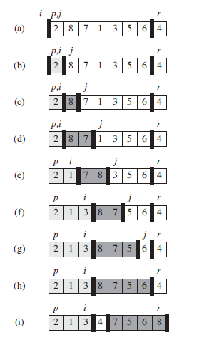

* Basic Idea **(recursion)**

  ```
  QUICKSORT(A, p, r)
  	if p < r
  		q = PARTITION(A, p, r)
  		QUICKSORT(A, p, q-1)
  		QUICKSORT(A, q+1, r)
  ```

* One Cursor Version

  ```
  PARTITION(A, p, r)
  	x = A[r]	// pivot
  	i = p-1
  	for j = p to r-1:
  		if A[j] <= x
  			i = i + 1
  			exchange A[i] with A[j]
  	exchange A[i+1] with A[r]
  	return i+1
  ```

* Left-Right Cursor Version

  ```c
  int PARTITION(int* arr, int start, int end)
  {
  	int L = start;		//Left
  	int R = end;		//Right
  	int key = L;		//选择最左边元素为key
  	if (L >= R)			//序列不存在或者只有一个元素
  		return L;
  	while (L < R){
  		//R先走，找小
  		while (L < R && arr[R] >= arr[key])
  			R--;
  		//L先走，找大
  		while (L < R && arr[L] <= arr[key])
  			L++;
  		Swap(&arr[L], &arr[R]);//L,R都停下来了，交换
  	}
  	//退出循环，L，R已经相遇
  	Swap(&arr[key], &arr[L]);//交换相遇处与key处的值
  	//此时key左边的值均小于key处的值，右边的值均大于key处的值
  	return L;//新的key——L,R相遇的位置
  }
  ```

* **Using Stack to implement QS**

  * Basic Idea:

  * 思路如下：

    1. 先将待排序序列最左边与最右边元素的下标入栈。

    2. 在栈不为空的情况下进入循环，读取栈中数据记作L，R。

    3. 将L,R传入部分排序函数，并返回一个将原序列分为左右两部分的下标，记作k。

    4. 判断左序列是否需要排序，若需要的话将左序列的L，R入栈。右序列进行一样操作。

    5. 反复执行上述操作，直至栈为空。

  ```c
  void QuickSort(int *arr,int start,int end)
  {
  	struct Stack ps;//建立栈
  	StackInit(&ps);//栈的初始化
  	StackPush(&ps, start);
  	StackPush(&ps, end);
  	while (!StackEmpty(&ps))//栈不为空时进入循环
  	{
  		int R = StackTop(&ps);//读取R
  		StackPop(&ps);//栈顶出栈
  		int L = StackTop(&ps);//读取L
  		StackPop(&ps);//栈顶出栈
  		int key = PartSort(arr,L,R);
  		if (L < key-1)//左序列还要进行排序
  		{
  			StackPush(&ps, L);//左序列L入栈
  			StackPush(&ps, key-1);//左序列R入栈
  		}
  		if(R > key+1)//右序列还要进行排序
  		{
  			StackPush(&ps, key + 1);//右序列L入栈
  			StackPush(&ps, R);//右序列R入栈
  		}
  	}
  }
  ```

### 7.2 Performance of Quicksort

* Worst-case Partitioning
  $$
  T(n)=T(n-1)+T(0)+\Theta(n) \\
  = \ \ \ T(n-1) + \Theta(n) \\
  \rightarrow
  \Theta(n^2)
  $$

* Best-case Partitioning
  $$
  T(n) = 2T(n/2) + \Theta(n) \\
  \rightarrow \\
  \Theta(nlogn)
  $$
  The running time is therefore $\Theta(nlogn)$ whenever the split has constant proportionality. 

  * Analysis by Partition Tree:
    In fact, any split of constant proportionality yields a recursion tree of depth $O(logn)$, where the cost at each level is $O(n)$.

### 7.3 Optimizing of Quicksort

1. Randomized version of quicksort

   ```
   RANDOMIZED-PARTITION.A; p; r/
   	i = RANDOM(p,r)
   	exchange A[r] with A[i]
   	return PARTITION(A, p, r)
   ```

2. Tail Recursive Quicksort 
   (reduction)

   ```
   TAIL-RECURSIVE-QUICKSORT(A, p, r)
   	while p<r
   	// partition and sort left subarray
   	q = PARTITION(A, p, r)
   	TAIL-RECURSIVE-QUICKSORT(A, p, q-1)
   	p = q+1
   ```

3. Median-of-3 partition

   One way to improve the RANDOMIZED-QUICKSORT procedure is to partition
   around a pivot that is chosen more carefully than by picking a random element from the subarray.

   One common approach is the median-of-3 method: choose the pivot as the median (middle element) of a set of 3 elements randomly selected from the subarray.


## Sec9 Medians and Order Statistics

* Definition of **Order Statistic**:
  The $i-th$ order statistic of a set of n elements is the $i-th$ smallest element.
* Selection Problem:
  * INPUT:
    A set $A$ of n (distinct) numbers and an integer i, with i <= i <= n.
  * OUTPUT:
    The element x ∈ A that is larger than exactly i-1 other elements of A.

### 9.1 Minimum and Maximum

* Method :
  Traditional Method. $O(n-1)$

* Simultaneous minimum and maximum:

  * Comparison Time:
    $$
    3\lfloor n/2\rfloor
    $$

  * Method:
    Rather than processing each element of the input by comparing it against the current minimum and maximum, at a cost of 2 comparisons per element. 

    We process elements **in pairs**. We compare pairs of elements from the input first with each other, and then we compare the smaller with the current minimum and the larger to the current maximum, **at a cost of 3 comparisons for every 2 elements**.

### 9.2 Selection in Expected Linear Time

* The idea is based on Quick-Sort

```
RANDOMIZED-SELECT(A, p, r, i)
	if p == r
		return A[p]
	q = RANDOMIZED-PARTITION(A, p, r)
	k = q - p + 1
	if i == k
		return A[q]
	elseif i<k
		return RANDOMIZED-SELECT(A, p, q-1, i)
	else return RANDOMIZED-SELECT(A, q+1, r, i-k)
```

* Analysis:
  **Master Theorem**

### 9.3 Selection in Worst-Case Linear Time

* Key idea: This algorithm can maintain a good partition
* Algorithm:
  1. Divide the n elements of the input array into $\lfloor n/5\rfloor$ groups of 5 elements each and at most one group made up of the remaining n mod 5 elements.
  2. Find the median of each of the $\lceil n/5\rceil$ groups by first insertion-sorting the elements of each group (of which there are at most 5) and then picking the median from the sorted list of group elements.
  3. Use SELECT recursively to find the median x of the $\lceil n/5\rceil$ medians found in step 2 (If there are an even number of medians, then by our convention, x is the lower median)
  4. Partition the input array around the median-of medians x using the modified version of PARTITION. Let k be one more than the number of elements on the low side of the partition, so that x is the k_th smallest element and there are n-k elements on the high side of the partition.
  5. If i = k, then return x. Otherwise, use SELECT recursively to find the i_th smallest element on the low side if i<k, or the (i-k)_th smallest element on the high side if i>k.


## Sec10 Elementary Data Structure

### 10.1 Stacks and Queues

* Simulating Recursive

* Stacks:
  * Push
  * Pop
* Queue
  * Enqueue
  * Dequeue

### 10.2 Linked Lists

* Doubly Linked List

  * key
  * \*next
  * \*prev

  * L.head

* Search
* Insert
* Delete
* Sentinel


## Sec11 Hash Tables

### 11.1 Direct-Address Tables

* Direct-address table
* Slot

### 11.2 Hash Tables

* Hash Function

#### Collision resolution by chaining

* Chaining

  ```
  CHAINED-HASH-INSERT(T, x)
  	insert x at ther head of list T[h(x.key)]
  
  CHAINED-HASH-SEARCH(T, k)
  	search for an element with key k in list T[h(k)]
  
  CHAINED-HASH-DELETE(T, x)
  	delete x from the list T[h(x.key)]
  ```

  

### 11.3 Hash Function

Good data -> Union Distribution

* The division method

* The multiplication method

* Universal hashing

  随机选择函数

### 11.4 Open Address

不用指针。如果对应位置没有找到，就往下寻找。（但可能会被填满

* 线性探查
  linear probing
* 二次探查
  quadratic probing
* 双重散列
  double hashing
  用于开放寻址法的最好方法之一


## Sec12 Binary Search Trees

### 12.1 binary search tree

* Inorder-Tree-Walk

  ```
  INORDER-TREE-WALK(x)
  	if x != NIL:
  		INORDER-TREE-WALK(x.left)
  		print x.key
  		INORDER-TREE-WALK(x.right)
  ```

* Preorder-Tree-Walk

  ```
  PREORDER-TREE-WALK(x)
  	if x != NIL
  		print x.key
  		PREOREDER-TREE-WALK(x.left)
  		PREOREDER-REE-WALK(x.right)
  ```

* Postorder-Tree-Walk

​	similarly

### 12.2 Querying a binary search tree

* Search

  ```
  TREE-SEARCH(x, k)
  	if x == NIL or k == x.key
  		return x
  	if k < x.key
  		return TREE-SEARCH(x.left, k)
  	else
  		return TREE-SEARCH(x.right, k)
  
  ITERATIVE-TREE-SEARCH(x, k)
  	while x != NIL and k != x.key
  		if k < x.key
  			x = x.left
  		else x = x.right
  	return x
  ```

* Successor
  分两种情况
  
  1. 存在右子树
     则后继为右子树中的最小值
  
  2. 不存在右子树
     往上找，直到找到第一个左孩子的最底层祖先
  
  ```
  TREE-SUCCESSOR(x)
  	if x.right != NIL
  		return TREE-MINIMUM(x.right)
  	y = x.p
  	while y!=NIL and x==y.right
  		x=y
  		y=y.p
  	return y
  ```
  
* Predecessor

  ```
  TREE-PREDECESSOR(x)
  	if x.left != NIL
  		return TREE-MAXIMUM(x.left)
  	y = x.p
  	while y != NIL and x==y.left
  		x = y
  		y = y.p
  	return y
  ```

### 12.3 Insertion and deletion

* Insertion

  ```
  TREE-INSERT(T, z)
  	y = NIL
  	x = T.root
  	while x != NIL
  		 y = x
  		 if z.key < x.key
  		 	x = x.left
  		 else x = x.right
  	// 结束条件为x=NIL，此时只需要保存x当前的parent
  	// 下一步是根据y的情况来插入y的左或者右
  	z.p = y
  	if y == NIL
  		T.root = z
  	else z.key < y.key
  		y.left = z
  	else y.right = z
  ```

* Deletion

  ```
  // 两个阶段，一是构造一个子函数transplant，二是分情况删除
  // 移植函数: 用一颗以v为根的子树来替换一颗以u为根的子树
  // 本质上是更换2个指针
  TREE-TRANSPLANT(T, u, v)
  	if u.p == NIL
  		T.root = v
  	elseif u == u.p.left
  		u.p.left = v
  	else u.p.right = v
  	if v != NIL
  		v.p = u.p
  // 删除操作，分3种情况
  TREE-DELETE(T, z)
  	if z.left == NIL
  		TRANSPLANT(T, z, z.right)
  	elseif z.right == NIL
  		TRANSPLANT(T, z, z.left)
  	else y = TREE-MINIMUM(z.right)
  		if y.p != z
  			TRANSPLANT(T, y, y.right)
  			y.right = z.right
  			y.right.p = y
  		TRANSPLANT(T, z, y)
  		y.left = z.left
  		y.left.p = y
  ```
  
  

## Sec15 Dynamic Programming

### 15.1 Rod Cutting

* Introduction
  We have a rod that total length is $L$ inch. The rod of $i$ inch corresponds the value of $p_i$. 
  How to choose the strategy of cutting rod to make the value max?

* Main Idea:

  Optimal Substructure: When we cut the rod for the first time, supposing that we cut in $i$ inch, then we have 2 smaller rod which length is $i$ and $L-i$ respectively. So we have the optimal substructure:
  $$
  q = \max\{q, p[i] + Cut\_Rod(n-i)\}
  $$

* Pseudo Code

  * Memory version
    **Key:** r[] is global variable. We save the sub-outcome r[]. When we call the upper recursive function, we can use the sub-outcome.

    ```
    Memoized-Cut-Rod(p[], L):
    	Let r[0...L] be a new array
        	For i = 0 to L
        		r[i] = -INF
        return Memoized-Cut-Rod-Aux(p[],L,r)
    
    Memoized-Cut-Rod-Aux(p[],length,r)
    	if r[length] >= 0
    		return r[length]
    	if length == 0
    		q = 0
    	else q = -INF
    		For i = 1 to length
    			q = max{q, p[i] + Memoized-Cut-Rod-Aux(p, length-i, r)}
    	r[length] = q
    	return q
    ```

  * Bottom-Up version
    **Key:** Computing the problem in non-decreasingly. And saving the sub-outcome.

    ```
    Bottom-Up-Cut-Rod(p[], length)
    	Let r[0...length] be a new array
    	r[0] = 0
    	For j = 1 to length
    		q = -INF
    		For i = 1 to j
    			q = max{q, p[i] + r[j-i]}
    		r[j] = q
    	return r[length]
    ```

### 15.2 Matrix-Chain Multiplication problem

求完全括号化方案！

* DP步骤：

  * 刻画一个最优解的结构特征
  * 递归定义最优解的值
  * 计算最优解的值，通常采用自底向上方法
  * 利用计算出的信息构造一个最优解

* 算法
  m[i, j] 保存代价。 s[i,j]记录分割点

  ```
  MATRIX-CHAIN-ORDER(p)
  	n = p.length - 1
  	let m[1...n, 1...n] and s[1...n-1, 2...n] be new tables
  	for i=1 to n
  		m[i,i] = 0
  	for l=2 to n
  		for i=1 to n-l+1
  			j=i+l-1
  			m[i, j] = INF
  			for k = i to j-1
  				q = m[i,k] + m[k+1, j] + p[i-1]p[k]p[j]
  				if q < m[i,j]
  					m[i,j] = q	// 最小代价
  					s[i,j] = k	// 最佳分割点
  ```

  O（n^3）

### 15.4 Longest-common-subsequence problem

* 步骤

  1. 刻画最长公共子序列的特征

     * X，Y为两个序列，Z为X，Y的任意最长公共子序列。则有：
       1. 若xm=yn，则zk= xm = yn。且Zk-1为Xm-1与Yn-1的一个LCS
       2. 若xm!=yn, 则zk!=xm意味着Z是Xm-1与Y的一个LCS
       3. 若xm!=yn, 则zk!=yn意味着Z是X与Yn-1的一个LCS

  2. 找递归解
     定义c[i,j]为Xi与Yj的LCS长度。则

     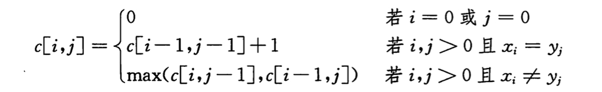

  3. 计算LCS长度

     ``` 
     LCS-LENGTH(X, Y)
     	m = X.length
     	n = Y.length
     	let b[1..m, 1..n] and c[0..m, 0..n] be new tables
     	for i=1 to m
     		c[i,0] = 0
     	for j=0 to n
     		c[0,j] = 0
     	for i = 1 to m
     		for j = 1 to n
     			if xi == yj
     				c[i,j] = c[i-1,j-1] + 1
     				b[i,j] = "↖"
     			elseif c[i-1,j] >= c[i,j-1]
     				c[i,j] = c[i-1,j]
     				b[i,j] = "↑"
     			else
     				c[i,j] = c[i,j-1]
     				b[i,j] = "←"
     ```

     O(mn)

     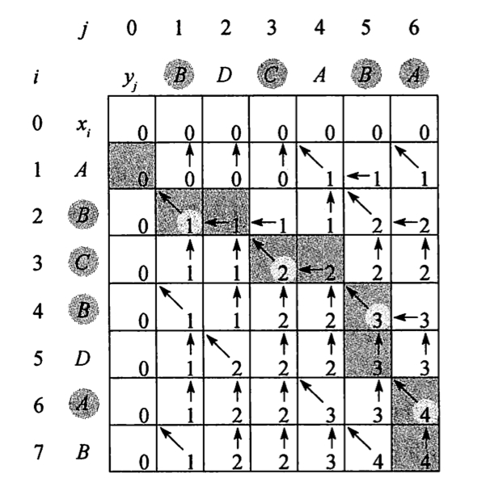

  ### 15.5 Optimal binary search tree

  分析出递推式！！！

  

  

## Sec16 Greedy Algorithm

### 16.1 活动选择问题

最优子结构性质

结束时间已经按单调递增的方式排列好

ak结束后的任务集

```
RECURSIVE-ACTIVITY-SELECTOR(s, f, k, n)
	m = k+1
	while m <= n and s[m] < f[k]
		m = m + 1; // find the first activity in Sk to finish
	if m<=n
		return {am} ∪ RECURSIVE-ACTIVITY-SELECTOR(s, f, m, n)
	else return ∅
```

```
// 尾递归形式
GREEDY-ACTIVITY-SELECTOR(s, f)
	n = s.length
	A = {a1}	// 最早完成的活动
	k = 1
	for m = 2 to n
		if s[m] >= f[k]
			A = A ∪ {am}
			k = m
	return A
```


### 16.3  Huffman算法


## Sec 18 B-Tree

* 内部节点x包含`x.n`个关键字，则x的子树有`x.n + 1`条，并且x内部关键字是子树的分割点

* 其中，除了根以外，其他的结点至少有t-1个关键字，最多有2t-1个关键字
  即，除根以外，其他结点的子树至少有t个，最多有2t个

* 搜索B树
  对每一个内部结点x，做的是一个`(x.n + 1)`路的分支选择

  ```
  // x为指向某子树根结点x的指针
  B-TREE-SEARCH(x, k)
  	i = 1
  	while i <= x.n and k > x.key[i]
  		i++
  	if i <= x.n and k == x.key[i]
  		return (x, i)
  	elseif x.leaf	// 如果x是leaf，则结束本次查找
  		return NIL
  	else DISK-READ(x, c_i)	// 递归向下查找
  		return B-TREE-SEARCH(x.c[i], k)
  ```

* 插入一个结点
  idea: 不能简单的创建一个叶节点然后插入，而是应该将新的关键字插入一个已经存在的叶节点上面。

  * 而且不能插入满的结点中，故引入操作
    将满结点y，按其中间关键字y.key[t]，分裂为2个各含t-1个关键字的结点，**中间关键字提升到y的父节点**, 以标识两颗新树的划分点。但若父节点也是满的，就继续重复操作。分裂沿途遇到的每个满结点。（包括叶结点本身）
  * 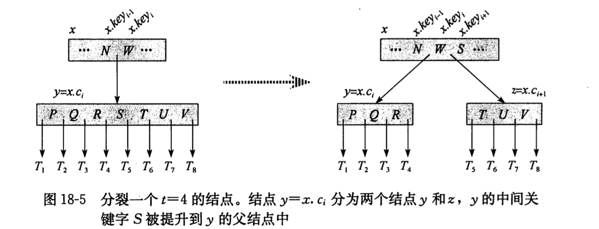

* 删除一个结点
  略


## Sec19 斐波那契堆

* 可合并堆
* 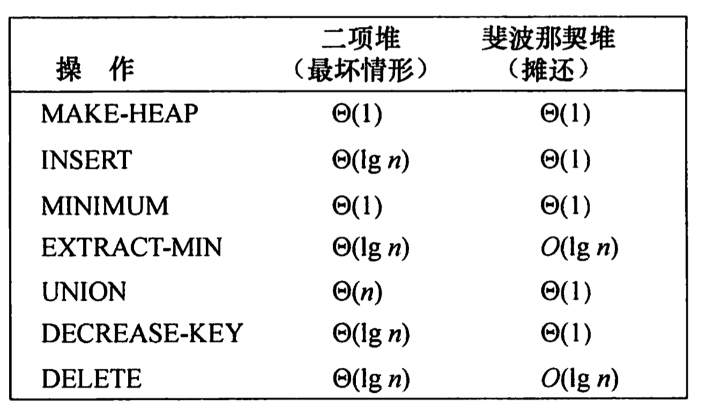


## Sec22 Elementary Graph Algorithms

### 22.1 Representations of graphs

* Concepts:
  * Path:
  * Trace
  * Cycle (Loop)
  * Circuit


* Adjacency-list representation
* Adjacency-matrix representation

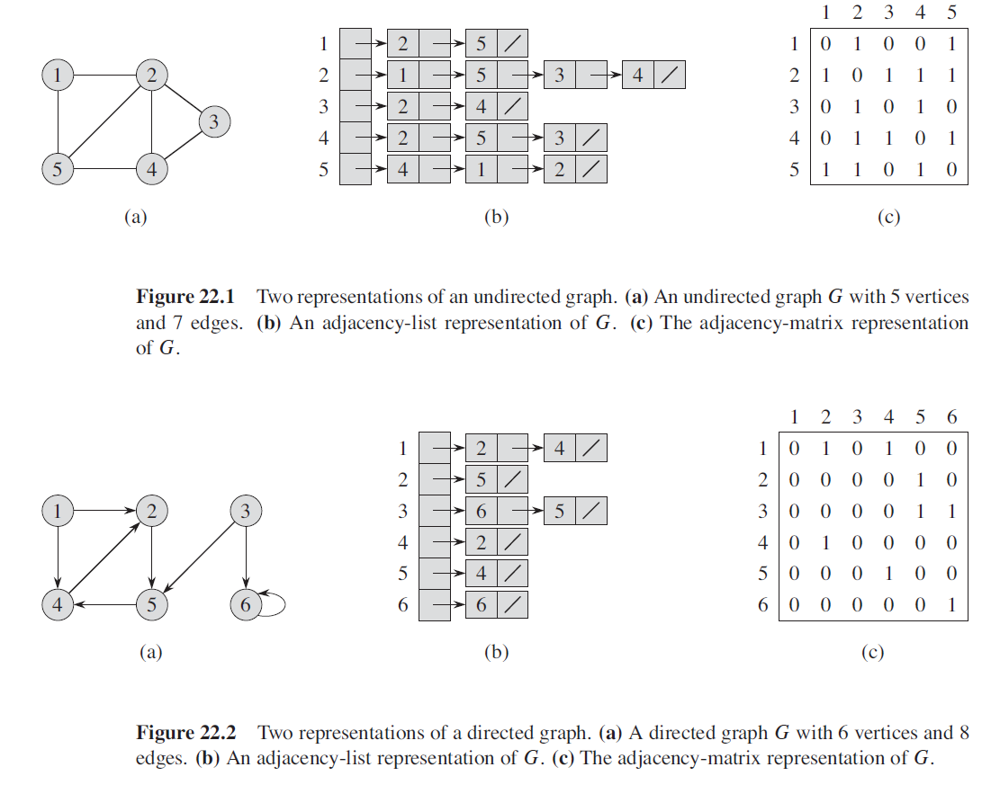

### 22.2 Breadth-First Search

#### 22.2.1 Basic Algorithm

```
BFS(G,s)
	for each vertex u ∈ G.V-{s}
		u.color = WHITE
		u.d 	= ∞
		u.π		= NIL
	s.color = GRAY
	s.d 	= 0
	s.π		= NIL
	Q = ∅
	ENQUEUE(Q,s)
	while Q != ∅
		u = DEQUEUE(Q)
		for each v ∈ G.Adj[u]
			if v.color == WHITE
				v.color = GRAY
				v.d = u.d + 1
				v.π = u
				ENQUEUE(Q,v)
		u.color = BLACK
```

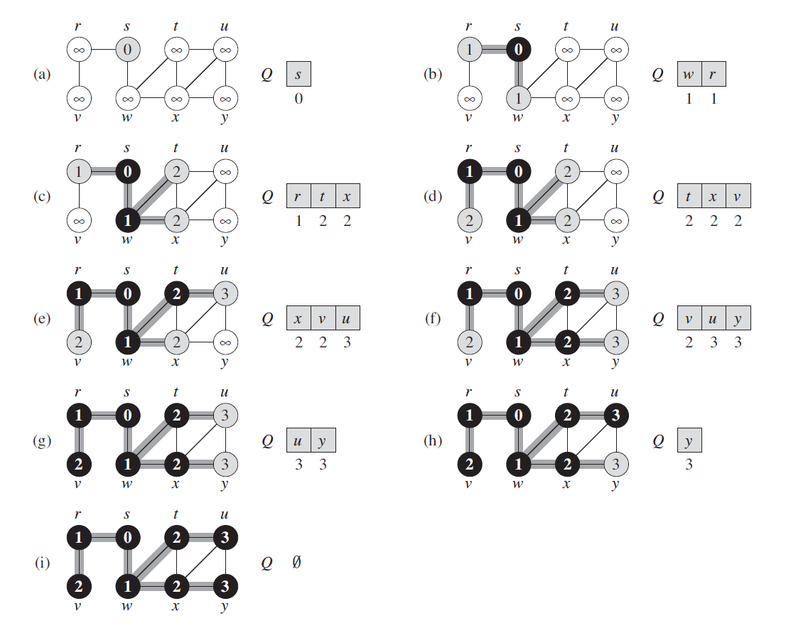


#### 22.2.2 Shortest paths

BFS find the distance to each reachable vertex in a graph G = (V,E) from a given source vertex s ∈ V.
We define **shortest-path distance**
$$
\delta(s,v)
$$

* (Correctness of Breadth-first search)
  Let $G=(V,E)$ be a directed or undirected graph, and suppose that BFS is run on $G$ from a given source vertex $s \in V$ . Then, during its execution, BFS discovers
  every vertex $v\in V$ that is reachable from the source $s$, and upon termination, $v.d=\delta(s,v)$ for all $v\in V$. Moreover, for any vertex v!=S that is reachable from s, one of the shortest paths from s to  is a shortest path from s to v.π followed by the edge (v.π, v).

  * Proof:

    * Lemma 1:
      Let $G=(V,E)$ be a directed or undirected graph, and let s ∈ V be an arbitrary vertex. Then, for any edge $(u,v)\in E$,
      $$
      \delta (s,v) \le \delta(s,u) + 1
      $$

    * Lemma 2
      Let $G=(V,E)$ be a directed or undirected graph, and suppose that BFS is run on $G$ from a given source vertex $s \in  V$. Then upon termination, for each vertex $v\in V$, the value $v.d$ computed by BFS satisfies $v.d\ge\delta(s,v)$.

      * Proof of Lemma2:
        Induction on the number of ENQUEUE operations.
        $$
        v.d = u.d+1\\\ge\delta(s,u)+1\\\ge\delta(s,v)
        $$

    * Lemma 3
      Suppose that during the execution of BFS on a graph G=(V,E), the queue Q contains the vertices $<v_1,v_2,...,v_r>$, where $v_1$ is the head of Q and $v_r$ is the tail. Then $v_r.d\le v_1.d+1$ and $v_i.d\le v_{i+1}$
      
      * Proof: Discussion the situation that enqueue and dequeue.
    
    * Theorem(Correctness of breadth-first search)
      Let $G=(V,E)$ be a directed or undirected graph, and suppose that BFS is run on $G$ from a given source vertex $s \in V$ . Then, during its execution, BFS discovers every vertex $v\in V$ that is reachable from the source $s$, and upon termination, $v.d=\delta(s,v)$ for all  $v\in V$ . Moreover, for any vertex $v\ne s$ that is reachable
    
      * Proof:
        By contradiction. Suppose v is the vertex that $v.d\ne \delta(s,v)$. Let u be the vertex immediately preceding v on a shortest path from s to v.
        Using lemmas, we can induct:
        $$
        v.d > \delta(s,v)=\delta(s,u)+1=u.d+1
        $$ { }
        The we consider the time when BFS chooses to dequeue vertex u from Q. We can prove that all of 3 conditions are contradiction to the inequility.

#### 22.2.3 Breadth-First Trees 

```
PRINT-PATH(G,s,v)
	if v == s
		print s
	elseif v.π == NIL
		print "no path from "s" to "v" exists"
	else PRINT-PATH(G,s,v.π)
		print v
```

* Analysis:
  $$
  O(V+E)
  $$
  

#### 22.2.4 Bipartite Matching Problems

* Sufficient-Necessary Condition:

  **There are at least two vertices in Figure G, and the lengths of all circuits in the figure are even**

* Algorithm:

  ```
  // 非递归(队列)写法
  Judge(G, s):
  	for each vertex u in G.V - {s}:
  		u.color = white
  	s.color = red
  	Q = []
  	ENQUEUE(Q,s)
  	while Q!=empty:
  		u = DEQUEUE(Q)
  		for each v in u.adj:
  			if v.color == while && u.color == red:
  				v.color == blue
  				ENQUEUE(Q, v)
  			else if v.color == while && u.color == blue:
  				v.color == red
  				ENQUEUE(Q,v)
  			else if u.color == v.color
  				break // 这个图不是二分图！
  				
  // 递归写法
  Judge_Recursive(G, s)
  	for each vertex u in s.adj:
  		if u.color == s.color
  			return FALSE
  		if u has not been colored:
  			u.color = color that different with s
  			if(!Judge_Recursive(G,v))
  				return FALSE
  ```

* Analysis:

  * Initial: O(V)
  * Color: O(V+2E+V)

### 22.3 Depth-First Search

#### 22.3.1 Basic Algorithm

* Algorithm:

  ```
  DFS(G, s)
  	for each vertex u in G:
  		u.color = WHITE
  		u.π = NIL
  	time = 0
  	for each vertex u in G:
  		if u.color == WHITE
  			DFS-VISIT(G,u)
  DFS-VISIT(G,u)
  	time++
  	u.d = time
  	u.color = GRAY
  	for each v in G.Adj[u]
  		if v.color == WHITE
  			v.π = u
  			DFS-VISIT(G,v)
  	u.color = BLACK
  	time++
  	u.f = time
  ```

  * Example:
    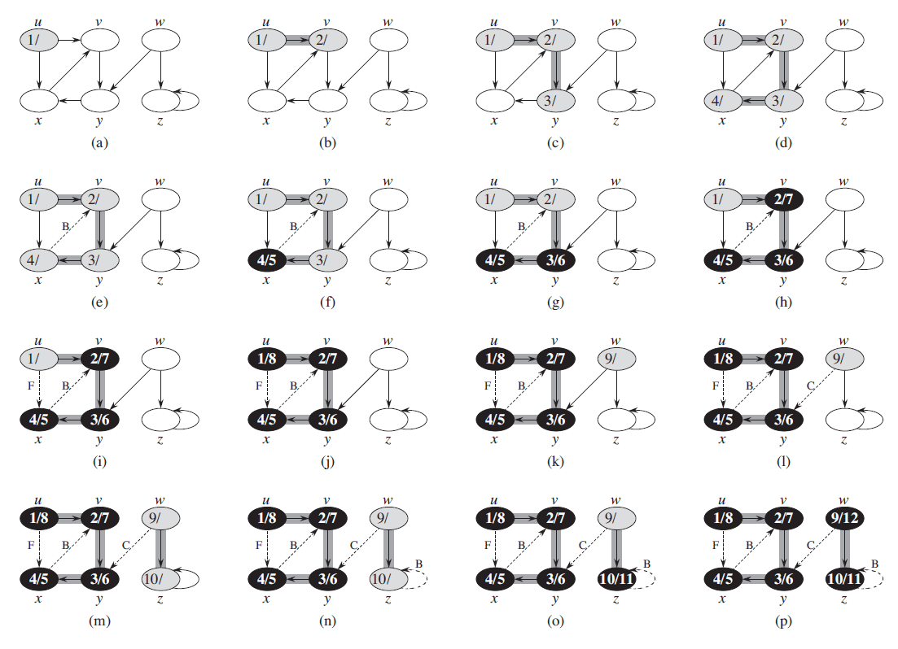

  * Analysis:
    $$
    \Theta(V+E)
    $$

#### 22.3.2 Some Theorems

* Theorem 1: Parenthesis theorem:
  In any depth-first search of a (directed or undirected) graph $G=(V,E)$, for any two vertices u and v, exactly one of the following three conditions holds:

  1. The intervals $[u.d,u.f]$ and $[v.d,v.f]$ are entirely disjoint, and neither $u$ nor $v$ is a descendant of the other in the depth-first forest. (In different predecessor subgraph)
  2. The interval $[u.d,u.f]$ is contained entirely within the interval $[v.d,v.f]$, and u is a descendant of v in a depth-first tree.
  3. The interval $[v.d,v.f]$ is contained entirely within the interval $[u.d,u.f]$, and v is a descendant of u in a depth-first tree

  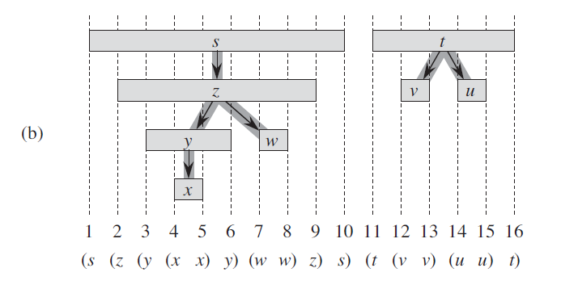

  * Corollary:(Nesting of descendants’ intervals)
    Vertex v is a proper descendant of vertex u in the depth-first forest for a (directed or undirected) graph G if and only if $u.d < v.d < v.f<u.f$

* Theorem: White-path theorem:
  In a depth-first forest of a (directed or undirected) graph $G=(V,E)$, vertex v is a descendant of vertex u if and only if at the time $u.d$ that the search discovers u there is a path from u to v consisting entirely of white vertices.

#### 22.3.3 Classification of Edges

* Classification:
  1. Tree edges
     if v was first discovered by exploring a tree edge (u,v).
  2. Back edges
     Back edges are those edges (u,v) connecting a vertex u to an ancestor in a depth-first tree. We consider self-loops, which may occur in directed graphs, to be back edges.
  3. Forward edges
     are those nontree edges (u,v) connecting a vertex u to a descendant in a depth-first tree
  4. Cross edges
     are all other edges. Between vertices in the same tree or different tree.
* Indication:
  * WHITE indicates a tree edge
  * GRAY indicates a back edge, and
  * BLACK indicates a forward or cross edge

### 22.4 Topological sort

#### 22.4.1 Algorithm

* Algorithm:

  ```
  TOPOLOGICAL-SORT(G)
  	call DFS(G) to compute finishing times v.f for each vertex v
  	as each vertex is finished, insert it onto the front of a linked list
  	return the linked list of vertices
  ```

* Example:
  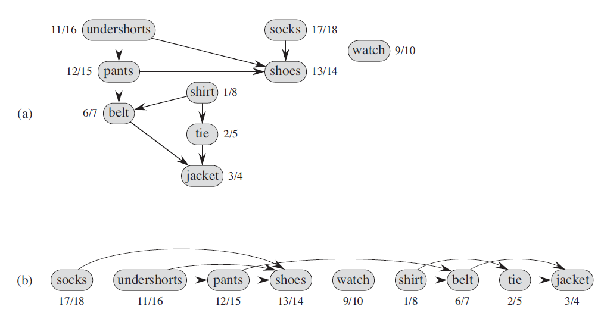

#### 22.4.2 Acyclic Graph

* Methods:

  * Undirected Graph

    1. Degree:

       ```
       1. 求出图中所有顶点的度，
       2. 删除图中所有度<=1的顶点以及与该顶点相关的边，把与这些边相关的顶点的度减一
       3. 如果还有度<=1的顶点重复步骤2
       4. 最后如果还存在未被删除的顶点，则表示有环；否则没有环
       ```

    2. DFS

       ```
       1. 每个节点分为三种状态，白、灰、黑。
       2. 开始时所有节点都是白色。
       3. 当开始访问某个节点时该节点变为灰色，当该节点的所有邻接点都访问完，该节点颜色变为黑色。
       4. 如果遍历的过程中发现某个节点有一条边指向颜色为灰的节点，那么存在环。
       ```

  * Directed Graph

    1. Topological Sort

       ```
       拓扑排序的kahn算法:
       	1. 计算图中所有点的入度，把入度为0的点加入栈
       	2. 如果栈非空：
       		取出栈顶顶点a，输出该顶点值，删除该顶点
       		从图中删除所有以a为起始点的边，如果删除的边的另一个		  	顶点入度为0，则把它入栈
       
       	3. 如果图中还存在顶点，则表示图中存在环；否则输出的顶点就是一个拓扑排序序列
       ```

  * Using Strongly connected component:

    ```
    本质上还是DFS
    Kosaraju算法使用了两次深度优先搜索。在原始图中，第一次搜索用于决定第二个深度优先搜索的外层循环的顺序，该循环测试已经访问过的顶点，如果没有，则用递归的手段搜索它们。第二次深度优先搜索是在原始图的转置图上进行，每个递归搜索都能找到一个新的强连通分量
    ```

### 22.5 Strongly connected component

(Application of DFS, decomposing a directed graph into its strongly connected components)

* Algorithm:

  ```
  STRONGLY-CONNECTED-COMPONENTS(G):
  	call DFS(G) to compute finishing time u.f for each vertex u
  	compute G^T
  	call DFS(G^T), but in the main loop of DFS, consider the vertices in order of decreasing u.f (as computed in line 1)
  	output the vertices of each tree in the depth-first forest formed in line 3 as a separate strongly connected component
  ```

* Proof:

  * Lemma 1:
    Let C and C’ be distinct strongly connected components in directed graph $G=(V,E)$. Suppose that there is an edge $(u,v)\in E$, where $u\in C$ and $v\in C'$. Then $f(C)>f(C')$.

  * Corollary:
    Let C and C’ be distinct strongly connected components in directed graph G = (V,E). Suppose that is an edge $(u,v\in E^T)$, where $u\in C$ and $v\in C'$. Then $f(C)<f(C')$

  * Correctness of Algorithm

    ```
    对第一次DFS发现的树的个数进行归纳。
    k=0显然
    设k=n时成立，且前面n个树均为强连通分量
    则k=n+1的时候，由Corollary可以知道，也是一个强连通分量
    ```

  * Another Perspective:

    ```
    可以视作，第一次的时候，确定了拓扑排序
    第二次DFS根据拓扑排序的逆序顺序来访问G^SCC的结点的
    ```


## Sec23 Minimum Spanning Trees

### 23.1 Growing a MST

```
GENERIC-MST(G, w)
	A = ∅
	while A does not form a spanning tree
		find an edge (u,v) that is SAFE for A
		A = A ∪ (u,v)
	return A
```

* Some concepts:

  * cut
    A partition of V.
  * light edge
    Its weight is the minimum of any edge crossing the cut.
  * respect
    A cut respects a set A of edges if no edge in A crosses the cut.

* **Theorem 23.1** (recognizing sage edges)
  Let $G = (V,E)$ be a connected, undirected graph with a real-valued weight function $w$ defined on E. Let A be a subset of E that is included in some minimum spanning tree for G, let $(S,V-S)$ be any cut of G that respects A, and let $(u,v)$ be a light edge crossing $(S,V-S)$. Then, edge $(u,v)$ is safe for A.

  **Proof:** (cut-and-paste technique)
  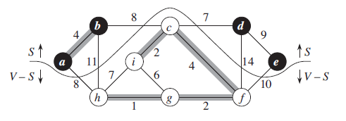
  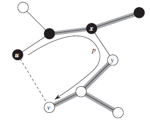

  ​	The edge $(u,v)$ forms a cycle with the edges on the simple path $p$ from $u$ to $v$ in $T$, as the figure illustrates. Since $u$ and $v$ are on opposite sides of the cut $(S,V-S)$, at least one edge in T lies on the simple path $p$ and also crosses the cut. Let $(x,y)$ be any such edge. The edge $(x,y)$ is not in A, because the cut respects A. Since $(x,y)$ is on the unique simple path from $u$ to $v$ in $T$, removing $(x,y)$ breaks $T$ into two components. Adding $(u,v)$ reconnects them to form a new spanning tree $T'=T-\{(x,y)\}\cup\{(u,v)\}$.

  ​	Next we show that $T'$ is a minimum spanning tree. Since $(u,v)$ is a light edge crossing $(S,V-S)$ and $(x,y)$ also crosses this cut, $w(u,v)\le w(x,y)$. Therefore, $w(T') = w(T) - w(x,y)+w(u,v) \le w(T)$

  But T is a MST, so that $w(T)\le w(T')$; Thus, $T'$ must be a minimum spanning tree also. So $(u,v)$ is safe for A 

### 23.2 Kruskal

**Greed Algorithm for EDGE**
(suitable for Sparse Graph)

```
MST-KRUSKAL(G,w)
	A = ∅
	for each vertex v ∈ G.v
		MAKE-SET(v)
	SORT the edges of G.E into nondecreasing order by weight w
	for each edge(u,v)∈G.E, taken in nondecreasing order by weight:
		if FIND-SET(v) ≠ FIND-SET(v)
			A = A ∪ {(u,v)}
			UNION(u,v)
	return A
```

* Implementation:

  * Disjoint Set Union

* Complexity

  * Sort: $O(ElogE)$
  * the number of FIND-SET and UNION processes take $O(ElogE)$

  Total:
  $$
  O(ElogE)
  $$
   Because $E\lt V^2$, so we can also write it as $O(ElogV)$
  
* Correctness proof
  ```
  给一带权连通的树一定会有至少一棵生成树，那么这些生成树中间必然会会存在至少一棵最小生成树。 
  假设T是用kruskal求出来的最小生成树，而U是这个图的最小生成树，如果U == T,那么证明结束。 
  然而如果T ！= U，那么至少存在一条边在T中，不在U中。那么我们希望证明T和U中所有边的权值之和是相等的。假设存在k条边存在T中不存在U中。 
  接下来进行k次变换： 
  每次将在T中不在U中的最小的边f拿出来放到U中，那么U中必然形成一条唯一的环路，我们取出这个环路上最小的且不再T中的边e放回到T中，这样的边e一定是存在的，因为之前的T不存在环路（如果e在T中那么就可能和f形成环路）。 
  现在证明f和e的关系，如果f和e相等的，那么k次变换后，T和U的权值之和是相等的，那么证明就成立了。 
  假设f < e,那么后来形成的U是权值之和更小了，与U是最小生成树矛盾。 
  假设f > e,那么根据kruskal的做法，e是在f之前被取出来的边但是被舍弃了，一定是因为e和比e小的边形成了环路，而比e小的边都是存在U中的，而e和这些边并没有形成环路，于假设矛盾。 
  所以f = e。
  ```

  

### 23.3 Prim

**Greed Algorithm for VERTEX**
(suitable for Density Map)

```
MST-PRIM(G,w,r)
	for each u ∈ G.v:
		u.key = ∞
		u.π = NIL
	r.key = 0
	Q = G.V
	while Q ≠ ∅
		u = EXTRACT-MIN(Q)
		for each v ∈ G.Adj[u]
		if v ∈ Q and w(u,v) < v.key
			v.π = u
			v.key = w(u,v)
```

* Procedure

  1. Initial the key and π of each vertex
  2. Build a min-heap for every vertex in G.V
  3. Extract min each time and add the vertex in V-Q (Extract-Min)
  4. modify π and key for each vertex extract from Q (Decreasing-key)

* Complexity

  1. Build a heap: $O(V)$
  2. Extract-Min: $VlogV$
  3. We can implement the test for membership in Q in constant time by **Keeping a Bit** when the vertex is removed from Q
  4. Decreasing-Key operation: $ElogV$

  Total: (implemented by min-HEAP)
  $$
  O(ElogV)
  $$

* Correctness proof
  easy. pass. See 23.1
  
* Note:

  * if it is **density graph** and we have a data structure **Adjacency Matrix**. We can use one-dimension array to replace the min-Heap with $O(V^2)$ complexity totally
  * if it is **sparse graph** and we have a data structure **Adjacency List**. We can use Min-Heap. Total complexity is $O(Elog V)$
  * Fibonacci heap: $O(E+VlogV)$ . Main improvement is Fibonacci heap can shorten the time of Decreasing-Key to $O(1)$.


## Sec24 Single-Source Shortest Path

* Several Important Lemmas or Properties:
  * Subpaths of shortest paths are shortest paths
  * Triangle inequality
    For any edge $(u,v) \in E$, we have $\delta(s,v)\le\delta(s,u)+w(u,v)$
  * Upper-bound property
  * Convergence property
  * **Path-relaxation property**
    If $p=<v_0,v_1,...,v_k>$ is a shortest path from $s = v_0$ , and we relax the edges of p in the order $(v_0,v_1),(v_1,v_2),...,(v_{k-1},v_k)$, then $v_k.d = \delta(s,v_k)$
    This property holds regardless of any other relaxation steps that occur, even if they are intermixed with relaxations of the edges of p.

* Relaxation:

  ```
  INITIALIZE-SINGLE-SOURCE(G, s)
  	for each vertex v ∈ G.V
  		v.d = ∞
  		v.π = NIL
  	s.d = 0
  
  RELAX(u,v,w)
  	if v.d > u.d + w(u,v)
  		v.d = u.d + w(u,v)
  		v.π = u
  ```

### 24.1 Bellman-Ford Algorithm

The edge weights may be negative. 
And this algorithm returns a boolean value indicating whether or not the there is a negative-weight cycle that is reachable from the source. 

```
BELLMAN-FORD(G,w,s)
	INITIALIZE-SINGLE-SOURCE(G,s)
	for i = 1 to |G.V| - 1
		for each edge (u,v) ∈ G.E
			RELAX(u,v,w)
		for each edge (u,v) ∈ G.E
			if v.d > u.d + w(u,v)
				return FALSE
		return TRUE
```

* Example:
  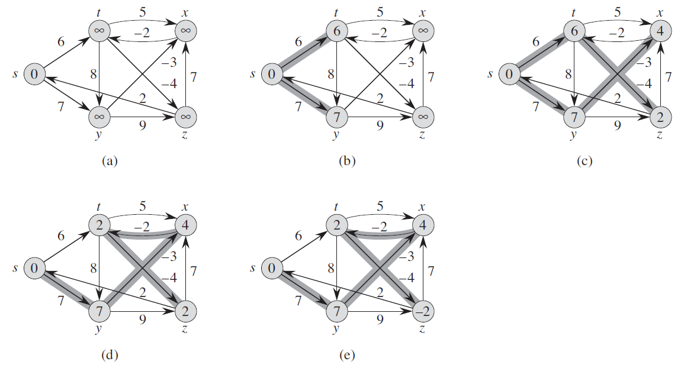

* Complexity
  $$
  O(VE)
  $$

* Correctness
  According to **Path-relaxation property**, the algorithm can compute correct shortest-path weights for all vertices reachable from source when there are no negative-weight cycles.

  Then we prove that Bellman-Ford Algorithm will return TRUE when there are no negative-weight cycles, and return FALSE when there are some negative-weight cycles.

  *Proof*: First we know that at termination, $v.d = \delta (s,v)$ for all vertices v ∈ V. Then for all of the edges:
  $$
  v.d = \delta(s,v) \le \delta(s,u)+w(u,v)+u.d+w(u,v)
  $$
  So it will return TRUE if all of the edges follow the inequility.

  Now suppose that graph $G$ contains a negative-weight cycle that is reachable form the source $s$; let this cycle be $c=<v_0,v_1,...,v_k>$, where $v_0=v_k$. Then,
  $$
  \sum_{i=1}^k w(v_{i-1}, v_i) < 0
  $$
  Assume for the purpose of contradiction that the Bellman-Ford algorithm returns TRUE. Thus $v_i.d\le v_{i-1}.d+w(v_{i-1},v_i) $ for i = 1,2,...,k. Summing the inequalities around cycle c gives us
  $$
  \sum^k_{i=1}v_i.d \le\sum^k_{i=1}(v_{_{i-1}}.d+w(v_{i-1},v_i))
  $$

​	Since $v_0 = v_k$, each vertex in $c$ appears exactly once 	in each of the summations $\sum_{i=1}^kv_i.d$ and $\sum_{i=1}^kv_{i-1}.d$, 	and so :
$$
\sum_{i=1}^k v_i.d = \sum_{i=1}^kv_{i-1}.d
$$
​	Thus, we have 
$$
0 \le \sum_{i=1}^kw(v_{i-1},v_i)
$$
​	which contradicts inequality.


### 24.2 Single-source shortest paths in directed acyclic graphs

By relaxing the edges of a weighted DAG (directed acyclic graph) $G = (V,E)$ according to a **topological sort** of its vertices, we can compute shortest paths from a single source in $O(V+E)$ time.

```
DAG-SHORTEST-PATHS(G,w,s)
	Topologically sort the vertices of G
	INITIALIZE-SINGLE-SOURCE(G,s)
	for each vertex u, taken in topologically sorted order
		for each vertex v ∈ G.Adj[u]
			RELAX(u,v,w)
```

* Example:
  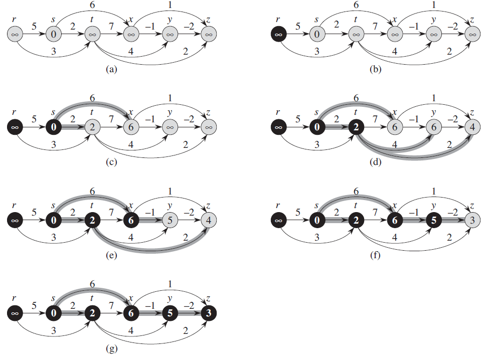

* Complexity

  1. Time of topological sort: $O(V+E)$
  2. Time of initialize-single-source: $O(V)$
  3. Relax every edge exactly once: $O(E)$

  Total:
  $$
  O(V+E)
  $$

* Correctness

  * Lemma (**Predecessor-subgraph property**)
    Once $v.d = \delta(s,v) $ for all $v\in V$, the predecessor subgraph is a shortest-paths tree rooted at $s$

  If $v$ is not reachable form $s$, then $v.d = \delta(s,v)=\infty$ by the **No-Path Property**. Now suppose that $v$ is reachable from $s$ , so we have a shortest path $p$. Because we process the vertices in topologically sorted order, we relax the edges on $p$ in the order $(v_0,v_1),(v_1,v_2),...,(v_{k-1},v_k)$. The **path-relaxation property** implies that $v_i.d = \delta(s,v_i)$ at termination for i = 0,1,...,k. Finally, by the **predecessor-subgraph property**, $G_{\pi}$ is a shortest-paths tree.


### 24.3 Dijkstra’s Algorithm (KEY)

No negative-weight edge.

Maintains a set S of vertices whose final shortest-path weights from the source $s$ have already been determined.

**Greed Algorithm for VERTEX**

```
DIJKSTRA(G,w,s)
	INITIALIZE-SINGLE-SOURCE(G,s)
		S = ∅
		Q = G.V
		while Q ≠ ∅
			u = EXTRACT-MIN(Q)
			S = S ∪ {u}
			for each vertex v ∈ G.Adj[u]
				RELAX(u,v,w)
```

* Example:
  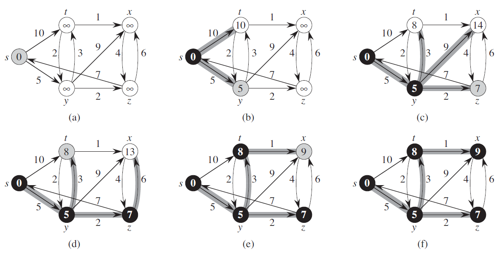

* Complexity

  * Operations:

    1. **INSERT** for every vertex
    2. **EXTRACT-MIN** for every vertex
    3. **DECREASE-KEY** （RELAX）(at most |E| times)

  * Data-Structure:

    * if **Sparse Graph**,$O(|E|)=O(|V|)$
      we can implement by **Binary Heap (min-queue)**
      Total:
      $$
      O((V+E)logV)
      $$

    * if **Density Graph**, $O(|E|)=O(|V|^2)$
      we can implement by **One-dimension Array**
      Total:
      $$
      O(V^2+E)
      $$

* Correctness
  Terminates with $u.d=\delta(s,u)$ for all vertices $u\in V.$
  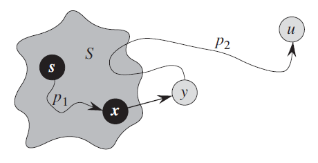

  **Loop Invariant:** At the start of each iteration of the while loop, $v.d = \delta(s,v)$ for each vertex $v\in S$

  * Initialization: $S=\empty$ , so it’s true

  * Maintenance: (Proving by contradiction)

    Let $u$ be the first vertex for which $u.d≠\delta(s,u)$ when it is added to set $S$.

    We have $ u ≠ s$, so $S ≠ \empty$ before u is added in $S$ and there must be some paths from s to u. Suppose that $p$ is the shortest path from $s$ to $u$.

    As shown in figure, Let us consider the first vertex $y$ along $p$ such that $y \in V-S$ (or the first vertex $y\notin S$), and let $x \in S$ be $y$’s predecessor along $p$. Thus, as Figure illustrates, we can decompose path $p$ into $s \rightsquigarrow^{p_1} x \rightarrow y \rightsquigarrow^{p_2} u$. (Either of paths p1 or p2 may have no edges.)

    (x≠y, but it may have s=x or y=u)

    As the assumption, because we chose $u$ as the first vertex for which $u.d \ne \delta(s,u)$ when it is added to $S$, $x.d = \delta(s,x)$. They we relax edge $(x,y)$, so we have $y.d = \delta(s,y)$. 

    We can now obtain a contradiction to prove that $u.d = \delta(s,u)$. 
    First, we have $\delta(s,y)\le \delta(s,u)$, and thus, 
    $$
    y.d = \delta(s,y) \le \delta(s,u) \le u.d
    $$
    However, as the algorithm, because both vertices $u$ and $y$ were in $V-S$ when $u$ was chosen in line 5, we must have $u.d \le y.d$. Thus we have 
    $$
    y.d = \delta(s,y)=\delta(s,u)=u.d
    $$
    

### 24.4 Difference constraints and shortest paths

use Bellman-Ford Algorithm 

draw the constrain graph first.
$$
V = \{v_0,v_1, ..., v_n\}\\
E = \{(v_i,v_j):x_j-x_i\le b_k\ is\ a\ constraint\} \\
	\ \ \ \ \ \      \ \ \ \ \  \cup \{(v_0,v_1),...,(v_0,v_n)\} \\

w(v_i,v_j) = b_k, (i\ne0) \\
w(v_0,v_i) = 0
$$

* Example:
  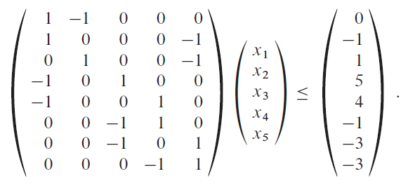

  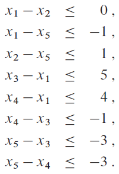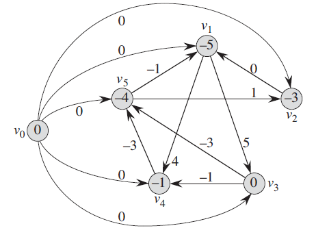

### 24.4 Some properties’ proof

* **Path-Relaxation Property**
  Prove by induction
* **Relaxation and shortest-paths trees**
  Interesting idea:
  -> proof by contradiction
  1. Suppose there are cycle in $G_\pi$
  2. **Sum all the weight in the cycle**
  3. Then we have a negative-weight cycle
  4. Contradiction

