# Automata Theory, Languages, and Computation

[TOC]


## Sec2 Finite Automata

### 2.1 Informal Picture of Finite Automata

* The Ground Rules
* The Protocol
* Enabling the Automata to Ignore Actions
* The Entire System as an Automaton
  * Product Automaton


### 2.2 Deterministic Finite Automata

#### 2.2.1 Definition of DFA

* Formal definition:
  $$
  A = (Q, \Sigma, \delta, q_0, F)
  $$

  1. A finite set of **states**, often denoted $Q$
  2. A finite set of **input symbols**, often denoted $\Sigma$
  3. A **transition function** that takes as arguments a state and an input symbol and **returns a state** The transition function will commonly be denoted $\delta$
  4. A **start state** one of the states in $Q$, denoted $q_0$
  5. A **set** of **final or accepting states** $F$. The set $F$ is a subset of $Q$

#### 2.2.3 Simpler Notations for DFA’s

* Transition diagram
  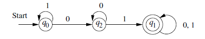
* Transition table
  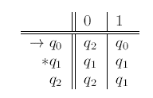

#### 2.2.4 Extending the Transition Function to Strings

* Assume that $w = xa$
  $$
  \hat{\delta}(q,w) = \delta(\hat{\delta}(q,x),a)
  $$

#### 2.2.5 The Language of a DFA

* Language:
  $$
  L(A) = \{w,|\hat{\delta}(q_0,w)\in F\}
  $$


### 2.3 Nondeterministic Finite Automata

#### 2.3.2 Formal Definition of NFA’s

* Definition by set:
  $$
  A = (Q,\Sigma,\delta,q_0,F)
  $$

  1. $Q,\Sigma,q_0,F$ is the same as DFA’s, representing finite set, input symbols, start state and accepting states set respectively.
  2. $\delta$, the transition function **returns a subset** of $Q$.

#### 2.3.3 Extended Transition Function

* Definition:

  * **BASIS**:
    $\hat{\delta}(q,\epsilon)={q}$.

  * **INDUCTION:**
    Suppose $w$ is of the form $w=xa$, where $a$ is the final symbol of $w$. Also suppose that $\hat{\delta}(q,x)={p_1,p_2,\dots,p_k}$. 
    Let:
    $$
    \bigcup_{i=1}^k\delta(p_i,a) = \{r_1,r_2,\dots,r_m\}
    $$
    Then $\hat{\delta}(q,w)={r_1,r_2,\dots,r_m}$. 

#### 2.3.4 The Language of an NFA

* Definition:
  $$
  L(A) = \{w|\hat{\delta}(q_0,w)\cap F \ne\empty\}
  $$

#### 2.3.5 Equivalence of Deterministic and Nondeterministic Finite Automata

* **Subset construction**
  $NFA\ N = (Q_N,\Sigma,\delta_N,q_0,F_N)$ --> $DFA\ D=(Q_D,\Sigma,\delta_D,\{q_0\},F_D)$
  Such that $L(D)=L(N)$

  * Steps:

    1. $Q_D$ is the set of subsets of $Q_N$

    2. $F_D$ is the set of subsets $S$ of $ Q_N$ such that $S\cap F_N\ne\empty $ 

    3. For each set $S\subseteq Q_N$ and for each input symbol $a$ in $\Sigma$ 
       $$
       \delta_D(S,a) = \bigcup_{p\ in\ S}\delta_D(p,a)
       $$

#### 2.3.6 A Bad Case for the Subset Construction

* Worst Case for Subset Construction
  If we have to track every state in NFA, there will be $2^n$ states for DFA.

* The Pigeonhole Principle

### 2.5 Finite Automata With Epsilon-Transitions

#### 2.5.2 The Formal Notation for an ε-NFA

* Notation:
  $$
  A=(Q,\Sigma,\delta,q_0,F)
  $$

  * all components have their same interpretation as for an NFA except that $\delta$ is now a function that takes as arguments:
    1. A state in $Q$, and
    2. A member of $\Sigma \cup\{\epsilon\}$ , that is either an input symbol or the symbol $\epsilon$ .
       We require that $\epsilon$ the symbol for the empty string cannot be a member of the alphabet $\Sigma$, so no confusion results.

#### 2.5.3 Epsilon-Closures

* Definition of Epsilon-Closure:
  * BASIS:
    State $q $ is in $ECLOSE(q)$
  * INDUCTION:
    If state $p$ is in $ECLOSE(q)$ and there is a transition from state $p$ to state $r$ labeled $\epsilon$, then $r$ is in $ECLOSE(q)$. 
    More precisely, if $\delta$ is the transition function of the $\epsilon-NFA$ involved, and $p $ is in $ECLOSE(q)$, then $ECLOSE(q)$ also
    contains all the states in $\delta(p,\epsilon)$

#### 2.5.4 Extended Transitions and Languages for ε-NFA’s

* Languages:
  $$
  L(E) = \{w|\hat{\delta}(q_0,w)\cap F \ne\empty\}
  $$

#### 2.5.5 Eliminating Epsilon-Transition

Let $E=(Q_E,\Sigma,\delta_E,q_0,F_E)$, then the equivalent $DFA$
$$
D = (Q_D,\Sigma,\delta_D,q_D,F_D)
$$

* Step:

  1. $Q_D$ is the set of subsets of $Q_E$. More precisely, all accessible states of $D$ are $\epsilon-closed$ subsets of $Q_E$.

  2. $q_D=ECLOSE(q_0)$

  3. $F_D$ is those sets of states that contain at least one accepting state of $E$. That is 
     $$
     F_D = \{S|S\ is\ in\ Q_D\ and\ S\cap F_E\ne \empty\}
     $$

  4. $\delta_D(S,a)$ is computed, for all $a$ in $\Sigma$ and sets $S$ in $Q_D$ by:

     * Let $S=\{p_1,p_2,\dots,p_k\}$
     * Compute $\bigcup_{i=1}^{k}\delta_E(p_i,a)$; Let this set be $\{r_1,r_2,\dots,r_m\}$
     * Then $\delta_D(S,a)=ECLOSE(\{r_1,r_2,\dots,r_m\})$


## Sec3 Regular Expressions and Languages

### 3.1 Regular Expressions

#### 3.1.1 The Operators of Regular Expressions

* union:
  $$
  L\cup M\ \ \ \ \ 
  or\ \ \ \ \ 
  L +M
  $$

* concatenation:
  $$
  LM \ \ \ \ \ or \ \ \ \ L \cdot M
  $$
  
* closure(or star, or Kleene closure)
  $$
  L^* = \bigcup_{i\ge 0}L^i
  $$

  * Note:
    $$
    \empty^* = \{\epsilon\}
    $$

### 3.2 Finite Automata and Regular Expressions

#### 3.2.1 From DFA’s to Regular Expressions

* Theorem: If $L=L(A)$ for some DFA, then there is a regular expression R such that L=L(R).

  * Proof:
    Assume the Regular Expression that we construct is $R_{ij}^{(k)}$ whose language is the set of strings $w$ such that $w$ is the label of a path from state $i$ to state $j$ in A, and that path has no intermediate node whose number is greater than $k$. (no constraint that $i$ and/or $k$ be less than or equal to $k$).
    

    * BASIS:
      The basis is $k=0$. Since all state are numbered 1 or above, so there is no intermediate state at all. Only 2 conditions satisfy.

      1. An arc from node i to node j.
      2. A path of length 0 that consists of only some node i.

      Then we have the following constructions:

      1. If there is no such symbol a, then $R^{(0)}_{ij}=\empty$.
      2. If there is exactly one such symbol a, then $R_{ij}^{(0)}=a$.
      3. If there are symbols $a_1,a_2,\dots,a_k$, that label arcs from state i to state j, then $R_{ij}^{(0)}=a_1+a_2+\dots+a_k$
      4. If i=j. Then we have a self-loop on i node. In the above situation, we can add label $\epsilon$ to the above Regular Expressions.

    * INDUCTION:
      Suppose there is a path from state i to state j that goes through no state higher than k There are two possible cases to consider

      1. The path does not go through state k at all:
         In this case, the label of the path is in the language of $ R^{(k-1)}_{ij} $

      2. The path goes through state k at least once:
         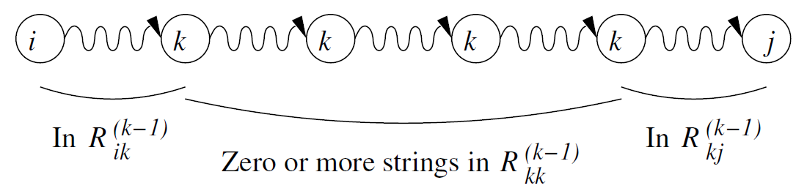
         $$
         R_{ik}^{(k-1)}(R_{kk}^{(k-1)})^*R_{kj}^{(k-1)}
         $$

    * Q.E.D

#### 3.2.2 Converting DFAs to Regular Expressions by Eliminating States

* Figure:
  

* Strategy:

  1. For each accepting state q, apply the above reduction process to produce an equivalent automaton with regular expression labels on the arcs.

  2. If $q\ne q_0$. We have a generic two-state automaton.

     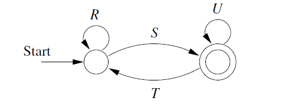

     The Regular expression is:
     $$
     (R+SU^*T)^*SU^*
     $$

  3. If the start state is also an accepting state. We will have a one-state automaton.
     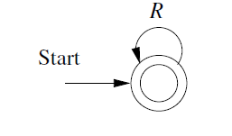
     The RE is:
     $$
     R^*
     $$

* Example:

  Key idea: Eliminating the intermediate state.


  

#### 3.2.3 Converting Regular Expressions to Automata

* Prove by Structural Induction on R:

  * BASIS:

    1. $\{\epsilon\}$

    2. $\empty$

    3. {a}

       

  * INDUCTION:

    1. $R+S$.

       The language is $L(R)\cup L(S)$

    2. $RS$
       Concatenation.

    3. $R^*$
       Closure

    4. $(R)$
       Unchanged.

    

### 3.4 Algebraic Laws for Regular Expressions

* Simplification of RE:

  1. $$
     \empty R = R \empty=\empty
     $$

     $\empty$ is an annihilator for concatenation. It results in itself when concatenated.

  2. $$
     \empty+R = R+\empty=R
     $$

     $\empty$ is the identity for union. It results in the other expression whenever it appears in a union.

  3. $$
     \epsilon L = L\epsilon = L
     $$

     $\epsilon$ is identity for concatenation.

  4. Distributive Laws:
     $$
     L(M+N)=(M+N)L = LM+LN
     $$

  5. The Idempotent Law:
     $$
     L+L=L
     $$

  6. Laws Involving Closures:

     1. $(L^*)^* = L^*$
     2. $\empty^*=\epsilon$
     3. $\epsilon^*=\epsilon$
     4. $L^+=LL^*$
     5. $L^*=L^++\epsilon$
     6. $L?=\epsilon+L$

     7. $(L+M)^*=(L^*M^*)^*$

* Discovering Laws for Regular Expressions:

  * Theorem:
    Let E be a regular expression with variables $L_1,L_2,\dots,L_m$.
    Form concrete regular expression $C$ by replacing each occurrence of $L_i$ by the symbol $a_i$ for $i=1,2,\dots,      m$ 
    Then for any languages $L_1,L_2,\dots,L_m$, every string $w$ in $L(E)$ can be written $w=w_1w_ 2\cdots w_k􀀀$ where each $w_i$ is in one of the languages, say $L_{j_{i}}$ and the string $a_{j_1}a_{j_2}\cdots a_{j_k}$ is in the language$ L(C)$. 


## Sec4 Properties of Regular Languages

### 4.1 Pumping Lemma for Regular Languages

* The Pumping lemma for Regular Languages:
  Let $ L$ be a regular languages. Then there exists a constant $n$(which depends on $L$) such that for every string $w$ in $L$ such that $|w|\ge n$, we can break $w$ into three strings $w=xyz$, such that:
  1. $y\ne \epsilon$
  2. $|xy|\le n$
  3. For all $k\ge 0$, the string $xy^kz$ is also in $L$.
* Proof:
  Using Pigeonhole Principle. Then deduct a contradiction.
  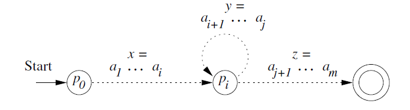

### 4.2 Closure Properties of Regular Languages

* Summary of the principal closure properties for regular **languages**:
  Two Languages:
  1. Union
  2. Intersection
  3. Complement
  4. Difference
  5. Reversal
  6. Closure(star)
  7. Concatenation
  8. Homomorphism(substitution of strings for symbols)
  9. Inverse Homomorphism

#### 4.2.1 Closure of Regular Languages Under Boolean Operations

* Closure Under Union
  * Proof:
    Suppose $L = L(R), M=L(S)$
    Then: $L\cup M=L(R+S)$
* Closure Under Complementation
  * Find a regular expression for its complement as follows
    1. Convert the regular expression to an $\epsilon-NFA$
    2. Convert that $\epsilon-	NFA$ to a $DFA$ by the subset construction
    3. **Complement the accepting states** of that $DFA$
    4. Turn the complement $DFA$ back into a regular expression.
  * Proof:
    Let $L=L(A)$ for some $DFA\ A=(Q,\Sigma,\delta,q_0,F)$. Then $\bar{L} = L(B)$. .Then the accepting states of $A$ have become nonaccepting states of $B$, and vice versa. Then $w$ is in $L(B)$ if and only if $\hat{\delta}(q_0,w)$ is in $Q-F$, which occurs if and only if $w$ is not in $L(A)$.

* Closure Under Intersection

  * Prove 1:
    $$
    L\cap M = \overline{\overline{L}\cup\overline{M}}
    $$

  * Prove 2:
    **Product Construction**:

    * Formal:
      $$
      A = (Q_L\times Q_M,\Sigma,\delta,(q_L,q_M),F_L\times F_M)
      $$
      where $\delta((p,q),a)=(\delta_L(p,a),\delta_M(q,a))$

* Closure Under Difference:

  * Prove:
    $$
    L-M=L\cap \overline{M}
    $$

#### 4.2.2 Reversal

* Construction:
  1. Reverse all the arcs in the transition diagram for A
  2. Make the start state of A **be the only accepting state** for the new automaton
  3. Create a new start state $p_0$ with transitions on $\epsilon$ **to all the accepting states of A**

* Proof:
  * BASIS:
    If E is $\epsilon, \empty$ or some symbol $a$. Then the reversal of it is itself.
  * INDUCTION:
    1. $E=E_1+E_2 \Rightarrow E^R=E_1^R+E_2^R$
    2. $E=E_1E_2\Rightarrow E^R=E_2^RE_1^R$
    3. $E=E_1^*\Rightarrow E^R=(E_1^R)^*$

#### 4.2.3 Homomorphisms

*A string **homomorphism** is a function on strings that works by **substituting a particular string for each symbol***

* Proof:
  Key idea: Prove $h(L(E))=L(h(E))$

  * BASIS:
    If $\epsilon,\empty$ or $a$. Obviously

  * INDUCTION:

    1. Union:
       Suppose $E=F+G$. Then $h(E)=h(F)+h(G)$.
       Then， $L(h(E))=L(h(F))\cup L(h(G))$. 

       By inductive hypothesis,  $h(L(E)) = h(L(F))\cup h(L(G)) = L(h(E))$

    2. Concatenation

    3. Closure

#### 4.2.4 Inverse Homomorphisms

* Tricks: Note that we can prove **the contrapositive** of the statement we set out to prove!

* Theorem: 
  If $h$ is a homomorphism from alphabet $\Sigma$ to alphabet $T$ and $L $ is a regular language over $T$ then $h^{-1}(L)$ is also a regular language

* Proof:
  
  ```
  核心思想：
  设a是B中的输入字符
  只要A接受h(a)=w，一连串后，到达A的接受状态，则B也到达接受状态
  则构造性证明完毕
  （B读入字符，相当于A读入一个字符串）
  ```
  
  Starts with a DFA A for L:
  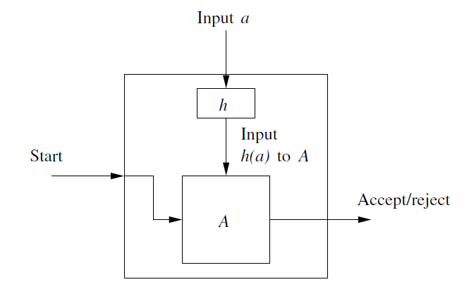
  Formally, let $L$ be $L(A)$, where $DFA\ A = (Q,T,\delta,q_0,F). $. Define a $DFA$:
  $$
  B=(Q,\Sigma,\gamma,q_0,F)
  $$
  where transition function $\gamma$ is constructed by the rule:
  $$
  \gamma(q,a)=\hat{\delta}(q,h(a))
  $$
  (h(a) could be ε) We can easily prove that $\hat{\gamma}(q_0,w)=\hat{\delta}(q_0,h(w))$​.Since the accepting states of A and B are the same, $B$ accepts $w$ if and only if $A$ accepts $h(w)$
  
  * Mooc 证明
    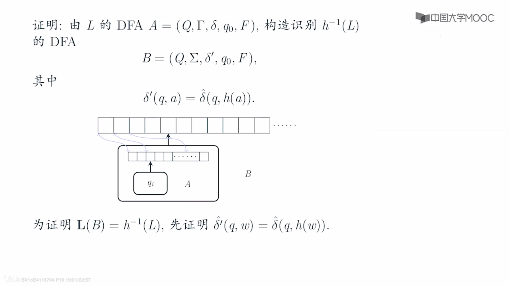
    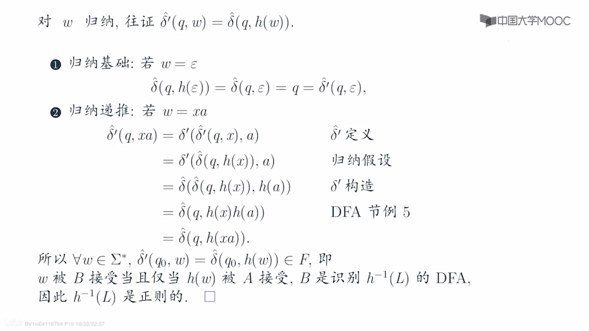


### 4.3 Decision Properties of Regular Languages

#### 4.3.1 Converting Among Representations

* Converting NFA’s to DFA’s
  * Computing the closure of $\epsilon$ takes $O(n^3)$. Or $O(n^2)$
  * The state of DFA can be $2^n$. After optimizing,we can reduce the time complexity to $O(n^3)$ (reachable set)
* DFA-to-NFA Conversion
  $O(n)$
* Automaton-to-Regular-Expression Conversion
  **Double exponential**. Because each is built from four expressions of the previous round
* Regular-Expression-to-Automaton Conversion
  $O(n)$ 

### 4.4 Equivalence and Minimization of Automata

#### 4.4.1 Testing Equivalence of States

* State $p$ and $q$ are equivalent if :

  * For all input string $w$, $\hat{\delta}(p,w)$ is an accepting state if and only if $\hat{\delta}(q,w)$ is an accepting state.

* State $p$ and $q$ are not equivalent, we say they are distinguishable. That is:

  * state $p$ is distinguishable from state $q$ if there is at least one string $w$ such that one of  $\hat{\delta}(p,w)$ and $\hat{\delta}(q,w)$ is accepting, and the other is not accepting.

* **Table-Filling Algorithm**

  * BASIS: 

    If $p$ is an accepting state and $q$ is nonaccepting, then the pair $\{p,q\}$ is distinguishable

  * INDUCTION:
    Let $p$ and $q$ be states such that for some input symbol $a,r=\delta(p,a)$ and $s=\delta(q,a)$ are a pair of states known to be distinguishable

#### 4.4.3 DFA Minimization

* First, eliminate any state that cannot be reached from the start state
* Then, partition the remaining states into blocks, so that all states in the same block are equivalent, and no pair of states from different blocks are equivalent


## Sec5 Context-Free Grammar and Context-Free Languages


## Sec6 Pushdown Automata


### 6.3 Equivalence of PDA’s and CFG’s

#### 6.3.1 From Grammars to Pushdown Automata

* Idea:
  To have the PDA simulate the sequence of left sentential forms that the grammar uses to generate a given terminal string $w$

* Formal Description:
  Let $G=(V,T,Q,S)$​ be a CFG, construct the PDA P that accepts L(G) by empty stack as follows.
  $$
  P=(\{q\},T,V\cup T,\delta,q,S)
  $$
  where transition function $\delta$ is defined by:

  1. For each variable A:
     $$
     \delta(q,\epsilon,A) = \{(q,\beta)|A\rightarrow\beta\ is\ a\ production\ of\ G\}
     $$

  2. For each terminal $a, \delta(q,a,a)=\{(q,\epsilon)\}$
  
* We can easily prove the construction by using **Chomsky Normal Form**

#### 6.3.2 From PDA’s to Grammars

* Idea:
  Construction of an equivalent grammar uses variables each of which represents an event consisting of:

  1. The net popping of some symbol X from the stack $X$, and
  2. A change in state from some $p$ at the beginning to $q$ when $X $ has finally been replaced by $\epsilon$ on the stack.

  We represent such a variable by the composite symbol $[pXq]$

* Theorem: 
  Let $P=(Q,\Sigma,\Gamma,\delta,q_0,Z_0)$ be a PDA Then there is a context free grammar $G$ such that $L(G)=  N(P)$

* Proof:

  * **Construction** of $G=(V,\Sigma,R,S)$

    * Where the set of variables V consists of:

      1. The special symbol $S$ which is the start symbol, and
      2. All symbols of the form $[pXq]$ where $p$ and $q$ are states in $Q$,  and $X$ is a stack symbol, in $\Gamma$

    * The productions of $G$ are as follows:

      1. For all states $p, G$ has the production $S \rightarrow [q_0Z_0p]$

      2. Let $\delta(q,a,X)$ contain the pair $(r,Y_1,Y_2,\dots,Y_k)$, where

         1. $a$ is either a symbol in $\Sigma$ or $a=\epsilon$
         2. $k$ can be any number, including 0, in which case the pair is $(r,\epsilon)$

         Then for any lists of states $r_1,r_2,\dots,r_k, G$ has the production:
         $$
         [qXr_k]\rightarrow a[rY_1r_1][r_1Y_2r_2]\dots[r_{k-1}Y_kr_k]
         $$

  * We can prove the correctness by INDUCTION.
    $$
    [qXp]\Rightarrow^*w, if\ and\ only\ if\ (q,w,X)\vdash^*(p,\epsilon,\epsilon)
    $$
    
    ```
    思想：
    为了在栈中完整的弹出一个栈符号，需要从输入带上，消耗掉一部分输出串。
    那么，消耗掉的这部分输入串，与栈中弹出的栈符号，是一种对应关系。
    如果我们将栈中的栈符号，看成是一个变元，
    那么就相当于，从这个栈符号的变元，可以派生出被消耗掉的那部分输出串
    步骤如下:
    0. 先对开始符号定义产生式，到所有的状态，模拟空栈接受PDA
    1. 从栈符号X替换为Y1...Yn, 状态从q变成p(中间的转台为r1,...,rn)
    2. 我们将这动作看成，先派生出一个a，然后让[pY1r1][r1Y2r2]...[rn-1Ynrn]分别派生剩下的PDA的输入串
    3. 然后我们可以用归纳，就能证明充分必要性
    注意，需要构造Q的n次方个产生式
    ```
  

### 6.4 Deterministic Pushdown Automata

#### 6.4.1 Definition of a Deterministic PDA

* We define a $PDA\ P=(Q,\Sigma,\Gamma,\delta,q_0,Z_0,F)$ to be a deterministic (DPDA), if and only if the following conditions are met:
  1. $\delta(q,a,X)$ has at most one member for any $q$ in $Q$, $a$ in $\Sigma$ or $a=\epsilon$, and $X$ in $\Gamma$
  2. If $\delta(q,a,X)$ is nonempty, for some a in $\Sigma$, then $\delta(q,\epsilon,X)$ must be empty

#### 6.4.2,3 Regular Languages, CFG, and DPDA

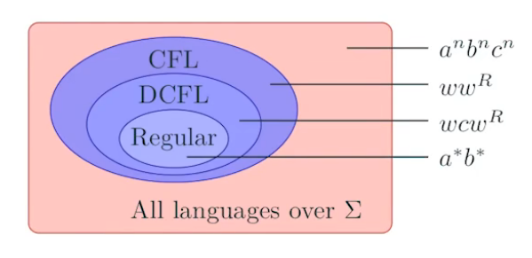


#### 6.4.4 DPDA’s and Ambiguous Grammars

* Theorem:
  If $L=N(P)$ for some DPDA P, then L has an unambiguous context-free grammar


## Sec7 Properties of Context-Free Languages

### 7.1 Normal Forms for Context-Free Grammars

* Preliminary Simplifications:
  1. Eliminate Useless Symbols
  2. $\epsilon-productions$
  3. Eliminate unit productions

#### 7.1.1 Eliminating Useless Symbols

* Identifying the 2 things a symbol has to be able to do:
  1. We say $X$ is generating if $X\Rightarrow^*w$ for some terminal string $w$. Every terminal is generating.
  2. We say $X$ is reachable if there is a derivation $S\Rightarrow^*\alpha X\beta$ for some $\alpha$ and $\beta$
* Order:
  1. First we check Generating.
  2. Then we check Reachable.

#### 7.1.3 Eliminating ε-Productions

* Nullable:
  A variable A is nullable if $A\Rightarrow^*\epsilon$.

* Method:
  If A is nullable, then whenever A appears in a production body, say $B\rightarrow CAD$, A might derive ε. We make 2 versions of the production:
  1. Without A in the body, say $B\rightarrow CD$.
  2. Cannot allow A to derive ε. Say $B\rightarrow C\hat{A}D$. and $\hat{A}$s are the productions of $A\rightarrow \hat A$

* Steps:
  1. Find the nullable symbols
  2. Consider the production R, that contains nullable symbols
  3. Add the productions in R, which contains all permutation and combination of nullable symbols

#### 7.1.4 Eliminating Unit Production 

* Unit production:
  is a production of the form A->B, where both A and B are variables.

* Find unit pair:
  * BASIS: (A,A) is a unit pair for any variable A.
  * INDUCTION: Suppose we have determined that (A,B) is a unit pair, and B->C is a production, where C is a variable, then (A,C) is a unit pair.

* Elimination:
  1. Find all the unit pairs of G
  2. For each unit pair (A,B), add to $P_1$ all the productions A->α, where B->α is a non-unit production in P. Note that A=B is possible; in that way, $P_1$ contains all the non-unit productions in P

#### 7.1.5 Chomsky Normal Form

* The order of Eliminations:
  1. Eliminate ε-productions
  2. Eliminate unit productions
  3. Eliminate useless symbols

* Definition of Chomsky Normal Form:

  The CFL without ε has a grammar G in which all productions are in one of 2 simple form, either:

  1. A->BC
  2. A->a, where a is a terminal.

* Construction:
  1. Arrange that all bodies of length or more consist only of variables
  2. Break bodies of length, or more into a cascade of productions, each with a body consisting of two variables

### 7.2 The Pumping Lemma for Context-Free Languages

* The Advantage of Using CNF: Turn parse trees into binary trees.

#### 7.2.2 Statement of the Pumping Lemma

* Lemma:

  Let L be a CFL. Then there exists a constant n such that if z is any string in L such that |z| is at least n, then we can write z=uvwxy, subject to the following conditions:

  1. |vwx|<=n. That is, the middle portion is not too long.
  2. vx!=ε. Since v and x are the pieces to be “pumped”. This condition says that at least one of the strings we pump must not be empty.
  3. For all i >= 0. $uv^iwx^iy$ is in L.

* Proof of CFG-Pumping Lemma:
  Using pigeonhole principle:
  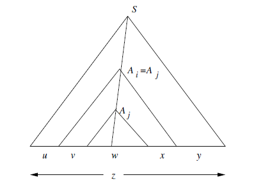
  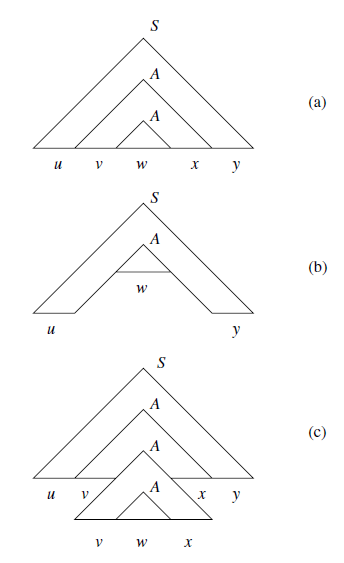

### 7.3 Closure Properties of Context-Free Languages

#### 7.3.1 Substitutions

* Theorem:
  If $L$ is a context free language over alphabet $\Sigma$, and $s$ is a substitution on $\Sigma$ such that s(a) is a CFL for each a in $\Sigma$, then s(L) is a CFL

* Proof:
  Say G=($V,\Sigma,P,S$) for L and $G_a=(V_a,T_a,P_a,S_a)$ for each a in $\Sigma$

  We construct a new grammar G’=(V’,T’,P’,S) for s(L), as follows

  * V’ is the union of V and all the $V_a's$ for a in $\Sigma$
    $$
    V'=V\cup (\bigcup_{a\in T}V_a)
    $$
  * T’ is the union of all the $T_a's$ for a in $\Sigma$
    $$
    T'=\bigcup_{a\in T}T_a
    $$
  * P’ consists of:
    1.  All productions in any $P_a$, for a in $\Sigma$
    2. The productions of P,but with each terminal a in their bodies replaced by $S_a$ everywhere a occurs
  
  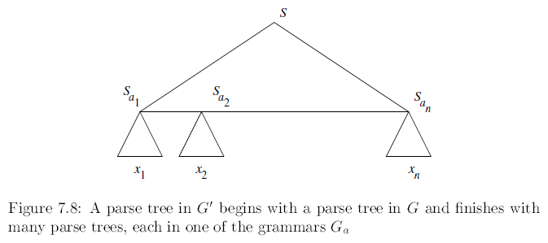

#### 7.3.2 Applications of the Substitution Theorem

* Theorem:
  The context free languages are closed under the following operations

  1. Union
  2. Concatenation
  3. Closure(\*), or positive closure
  4. Homomorphism
     s(a) = \{h(a)\}, -> , h(L) = s(L)

  

#### 7.3.3 Reversal

* CFL’s are closed under reversal

* Proof:
  Let L=L(G) for some CFL G=(V,T,P,S). Construct $G^R=(V,T,P^R,S)$, where $P^R$ is the reverse of each production in P. That is, if A->a is a production of G, the A->$a^R$ is a production of $G^R$.

#### 7.3.4 Intersection

* The CFLs are **not closed** under 2 CFG’s intersection.

* Theorem:
  If L is a CFL and R is a regular language, then $L\cap R$ is a CFL.

* Proof:
  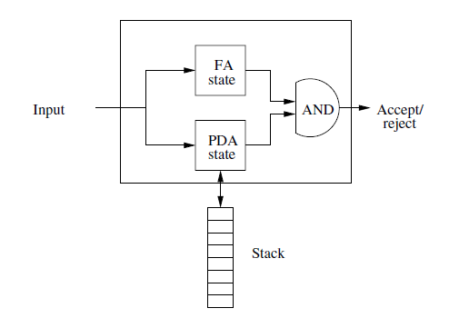

  * Formally:
    Let
    $$
    P=(Q_P,\Sigma,\Gamma,\delta_P,q_P,Z_0,F_P)
    $$
    be a PDA that accepts L by final state, and let:
    $$
    A=(Q_A,\Sigma,\delta_A,q_A,F_A)
    $$
    ne a DFA for R. Construct PDA:
    $$
    P'=(Q_P\times Q_A, \Sigma,\Gamma,\delta,(q_P,q_A),F_P\times F_A)
    $$
    where $\delta((q,p),a,X)$ is defined to be the set of all pairs $((r,s),\gamma)$ such that:

    1. $s=\hat{\delta}_A(p,a)$, and
    2. Pair $(r,\gamma)$ is in $\delta_P(q,a,X)$

* Another Theorems:

  If we have CFL L, L1 and L2, and regular languages R:

  1. L-R is CFL:

     * Proof:
       $$
       L-R=L\cap\bar{R}
       $$

  2. $\bar{L}$ is not necessarily a CFL:

     * Proof:
       Because $\bar{L}$ is also Context-Free. And we have:
       $$
       L_1\cap L_2 =\overline{\overline{L_1}\cup\overline{L_2}}
       $$
       So intersection is closed, too. We have a Contradiction.

  3. L1-L2 is not necessarily Context-Free
     If we choose L1 to be $\Sigma^*$. Then L1-L2 is $\overline{L2}$

#### 7.3.5 Inverse Homomorphism

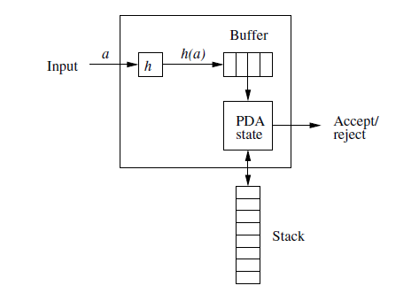

* Theorem:
  If L is CFL on $\Delta$, h is homomorphism from $\Sigma$ to $\Delta^*$. Then, $h^{-1}(L)$ is CFL, too.

  * Proof：
    Let $PDA\ P=(Q,\Delta,\Gamma,\delta,q_0,Z_0,F)$， $L(P)=L$. Constructing PDA of $L(P')=h^{-1}(L)$ :
    $$
    P'=(Q',\Sigma,\Gamma,\delta',[q_0,\bar\epsilon],Z_0,F\times
    \{\bar{\epsilon}\})
    $$
    In the states of P’, we use buffer, temporarily save the homomorphism string h(a) of symbol $a\in \Sigma$.

    1. $Q'\subset Q\times \Delta^*$: $\bar x$ in state $[q,\bar x]$ is buffer:

    2. Let $q\in Q$, then we define $\delta'$:

       1. $\forall [q,\bar\epsilon]\in Q\times \{\bar\epsilon\},\forall a\in \Sigma, \forall X\in \Gamma$:
          $$
          \delta'([q,\bar\epsilon],a,X)=\{([q,h(a)],X)\}
          $$

       2. If $\delta(q,\bar a, X)=\{(p_1,\beta_1),(p_2,\beta_2),\dots,(p_k,\beta_k)\}$, then:
          $$
          \delta'([q,\overline{ax}],\epsilon,X)=\{([p_1,\bar x],\beta_1),([p_2,\bar x],\beta_),\dots,([p_k,\bar x],\beta_k)\}
          $$
          Where $\bar a\in \Delta \cup\{\bar \epsilon\}$, $\bar x$ is the suffix of some h(a)
