# Computer Organization and Design

---


[TOC]

---


## Sec1 Abstraction

### 1.2 Eight Great Ideas in Computer

* Design for Moore’s Law
* Use Abstraction to Simplify Design
* Make the Common Case Fast
* Performance via Parallelism
* Performance via Pipelining
* Performance via Prediction
* Hierarchy of Memories
* Dependability via Redundancy

### 1.3 Below your Program

* OS(Operating System)
  * Handling Basic input and output operation
  * Allocating storage and memory
  * Providing for protected sharing of the computer multiple applications using it simultaneously

### 1.6 Performance *(KEY)* 

#### 1.6.1 Definition

* Response Time(Execution Time): 
  The total time required for the computer to complete a task
* Throughput(Bandwidth)
  it is the number of tasks completed per unit time.

#### 1.6.4 Instruction Performance

* CPI(Clock cycle per Instruction)
* IPC(Instruction per Clock cycle)

## Sec2 Instructions: Language of the Computer


pass


## Sec3 Arithmetic for Computers

### 3.2 Addition and Subtraction

* Subtraction： -> Complement

### 3.3 Multiplication

* A x B = C
  A: multiplicand
  B: multiplier
* Version 1

​	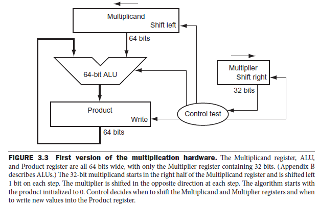

* Procedure:
  	In every iteration, shift left multiplicand and shift right multiplier. If 1, Product = Product + Multiplicand. Else, Product = Product.
  	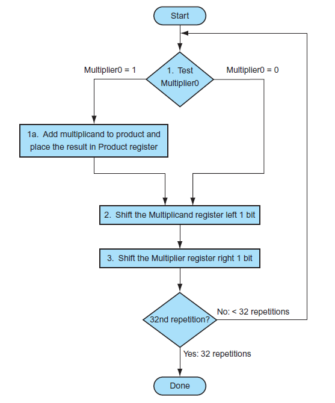
* Example：
  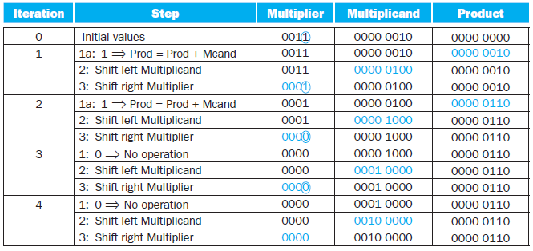

### 3.4 Division

* A / B = C...D
  A: Dividend
  B: Divisor
  C: Quotient
  D: Remainder

* Version 1
  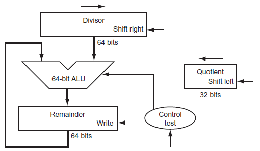

* Procedure:

  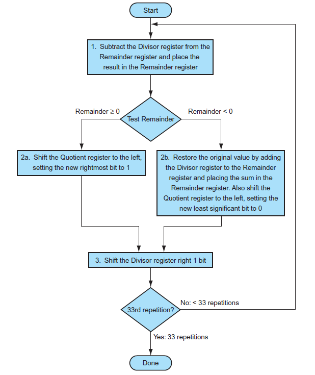

* Example
  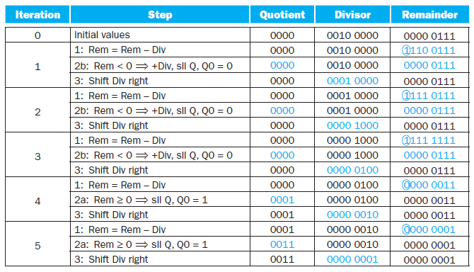


### 3.5 Floating Point

$$
(-1)^S\times (1+Fraction)\times2^{Exponent-Bias}  
$$

* Single Precision: Bias = 2^7-1 = 127
* underflow
  overflow
* 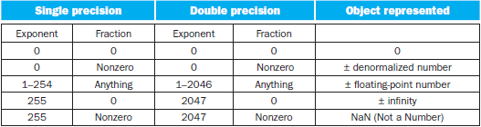

## Sec4 The Processor *(KEY)*

### 4.1 Introduction

* Key factors that determined the performance of a computer:
  * Instruction Count
  * Clock Cycle time
  * Clock per Instruction(CPI)

* Basic MIPS Instruction Set
  * Memory-reference instructions
  * Arithmetic-logical instructions
  * Branch instructions
* Procedure of Instruction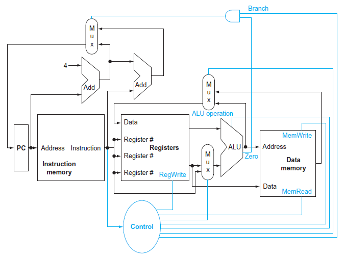
  * 3 Multiplexor 
    1. Branch Mul: Write the address to PC
    2. Decide the Write from ALU output or Data memory
    3. Decide the second input of ALU (register or instruction?)
  * Control unit

### 4.4 a simple Example

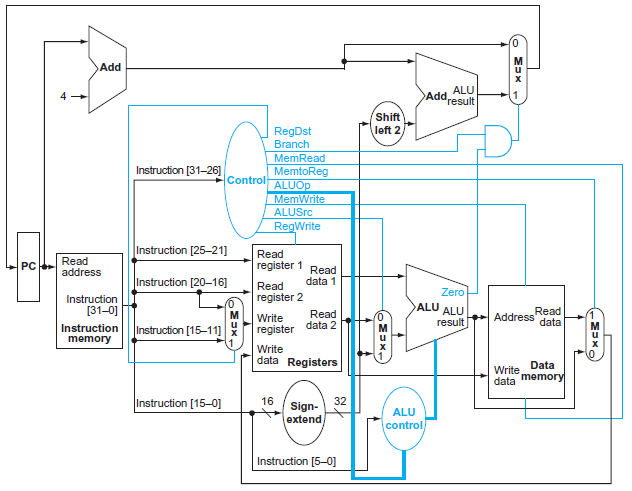

* Instruction

  * R-type
  * Load or store instruction
  * Branch instruction

* Field

  -rs-rt-rd-shamt-funct
  `eg: sub $t2 $t0 $t0`
  `0 - 8 - 9 - 10 -0 -34`
  	`   rs  rt  rd`

  * rs,rt: sources
  * rd: destination

* Control Signal
  * `RegDst`
  * `RegWrite`
  * `ALUSrc`
  * `PCSrc`
  * `MemRead`
  * `MemWrite`
  * `MemtoReg`

* *Why a Single-Cycle Implementation Is Not Used Today?*
  Inefficient. The clock cycle must have the same length for every instruction in this single-cycle design. Of course, the longest possible path in the processor determines the clock cycle.

  Th is path is almost certainly a load instruction, which uses five functional units in series: the instruction memory, the register file, the ALU, the data memory, and the register file.

### 4.5 An Overview of Pipelining (KEY)

* 5 processes of Instruction

  * Fetch instruction from memory
  * Read registers while decoding the instruction. The regular format of MIPS instructions allows reading and decoding to occur simultaneously.
  * Execute the operation or calculate an address.
  * Access an operand in data memory.

  Instruction Fetch -> Reg -> ALU -> Data access -> Reg

  OR:
  **IF - ID - EX - MEM - WB**

* $$
  Time \ between \ instructions_{pipelined} = \frac{Time\ between\ instruction_{nonpipelined}}{Number\ of\ pipe\ stages}
  $$

#### 4.5.1 Designing Instruction Sets for Pipelining

* all MIPS instructions are the same length
* MIPS has only a few instruction formats, with the source register fields being located in the same place in each instruction
* memory operands only appear in loads or stores in MIPS
* operands must be aligned in memory

#### 4.5.2 Hazards

* **Structural Hazard**: It means that the hardware cannot support the combination of instructions that we want to execute in the same clock cycle.
  *Or: When a planned instruction cannot execute in the proper clock cycle  because the hardware does not support the combination of instructions that are set to execute*

* **Data Hazard**: (pipeline data hazard)
  Data hazards occur when the pipeline must be stalled because one step must wait for another to complete.

  *Or: When a planned instruction cannot execute in the proper clock cycle because data that is needed to execute the instruction is not yet available.* 

  * Solution:

    We don’t need to wait for the instruction to complete before trying to resolve the data hazard.
    Adding extra hardware to retrieve the missing item early from the internal resources is called **forwarding** or **bypassing**.

  * Load-use data hazard

    A specific form of data hazard in which the data being loaded by a load instruction has not yet become available when it is needed by another instruction.

    * Solution: -> pipeline stall (bubble)
      Or we can also reordering Code to avoid pipeline stalls

* **Control Hazard (branch hazard)**

  Arising from the need to make a decision based on the results of one instruction while others are executing

  * Solution：

    * Stall

    * Prediction

      * Predicting that branches are not taken

      * Branch prediction

      * Delayed Decision(Delayed Branch)
        reordering the instructions that do not affect the branch after branch, such that hiding the branch.

        ​	*Since delayed branches are useful when the branches are short, no processor uses a delayed branch of more than one cycle. For longer branch delays, hardware-based branch prediction is usually used.*

  * Latency
    The number of stages in a pipeline or the number of stages between 2 instructions during execution

    pipelining improves instruction **throughput** rather than individual
    instruction execution time or latency.

### 4.6 Pipelined Datapath and Control

IF-ID-EX-MEM-WB

### 4.7 Data Hazards： Forwarding versus Stalling

* Hazard：
  * EX hazard
  * MEM hazard

* Stall:
  `nop` instruction ：An instruction that does no operation to change state.

#### 4.8 Control Hazards

* **Assume Branch Not Taken**

  If branch taken, we should **flush** IF, ID, EX level instructions.

* **Reducing the Delay of Branches**

  we have assumed the next PC for a branch is selected in the MEM
  stage, but if we move the branch execution earlier in the pipeline, then fewer instructions need be flushed.
  Moving the branch decision up requires two actions to occur earlier: 

  * computing the branch target address.

    We already have the PC value and the immediate fi eld in the IF/ID pipeline register, so we just move the branch adder from the EX stage to the ID stage

  * evaluating the branch decision.

    * During ID, we must decode the instruction, decide whether a bypass to the equality unit is needed, and complete the equality comparison so that if the instruction is a branch, we can set the PC to the branch target address.
    * Because the values in a branch comparison are needed during ID but may be produced later in time, it is possible that a data hazard can occur and a stall will be needed.

* **Dynamic Branch Prediction**

  Looking up the address of the instruction to see if a branch was
  taken the last time this instruction was executed, and, if so, to begin fetching new instructions from the same place as the last time.

  * Implementation
    * Branch prediction buffer (branch history table)
    * Branch target buffer: 
      A structure that caches the destination PC or destination instruction for a branch. It is usually organized as a cache with tags, making it more costly than a simple prediction buffer.
    * correlating predictor：
      A branch predictor that combines local behavior of a particular branch and global information about the behavior of some recent number of executed branches.
    * tournament branch predictor
      A branch predictor with multiple predictions for each branch and a selection mechanism that chooses which predictor to enable for a given branch.

  * Branch delay slot: 
    The slot directly after a delayed branch instruction, which in the MIPS architecture is filled by an instruction that does not affect the branch.

### 4.9 Exceptions

**exception**： Also called interrupt. An unscheduled event that disrupts program execution; used to detect overflow.


### 4.10 Parallelism via Instructions

2 methods to improve parallelism among instructions

* deepen the depth of pipelines
* multiple issue
  A scheme whereby multiple instructions are launched in one clock cycle.
  * static multiple issue
  * dynamic multiple issue

speculation: An approach whereby the compiler or processor guesses the outcome of an instruction to remove it as a dependence in executing other instructions.

## Sec5 Large and Fast: Exploiting Memory Hierarchy *(KEY)*

### 5.1 Introduction

* Principal of locality
  * Temporal locality:
    if an item is referenced, it will tend to be
    referenced again soon.
  * Spatial locality
    if an item is referenced, items whose addresses are close by will tend to be referenced soon
* Memory hierarchy:
  A structure that uses multiple levels of memories; as the distance from the processor increases, the size of the memories and the access time both increase.

* Performance
  * Hit rate / Hit ratio: 
    The fraction of memory accesses found in a level of the memory hierarchy.
  * Miss rate:
    The fraction of memory accesses not found in a level of the memory hierarchy.
  * Hit time:
    The time required to access a level of the memory hierarchy, including the time needed to determine whether the access is a hit or a miss.
  * Miss penalty:
    The time required to fetch a block into a level of the memory hierarchy from the lower level, including the time to access the block, transmit it from one level to the other, insert it in the level that experienced the miss, and then pass the block to the requestor.

### 5.2 Memory Technologies

* SRAM
  SRAMs have a fixed access time to any datum, though the read and write access times may diff er.

* DRAM
  it cannot be kept indefinitely and must periodically be refreshed

  Row organization: When the row is in the buffer, it
  can be transferred by successive addresses at whatever the width of the DRAM is (typically 4, 8, or 16 bits), or by specifying a block transfer and the starting address
  within the buffer.

* DDR: Double Data Rate (SDRAM: DRAM with clock)

* Flash Memory
  EEPROM

  (wear leveling: writes can wear out flash memory bits. To cope with such limits, most flash products include a controller to spread the writes by remapping blocks that have been written many times to less trodden blocks.)

* Disk Memory

  * track: One of thousands of concentric circles that makes up the surface of a magnetic disk.

  * sector: One of the segments that make up a track on a magnetic disk; a sector is the smallest amount of information that is read or written on a disk.
  * Seek : 
    The process of positioning a read/write head over the proper track on a disk.
  * rotational latency:
    The time required for the desired sector of a disk to rotate under the read/write head;

### 5.3 The Basics of Caches

* Direct mapped: A cache structure in which each memory location is mapped to exactly one location in the cache.
  $$
  (Block\ address)\ mod\ (Number\ of\ blocks\ in\ the\ cache)
  $$

* Tag: 
  field in a table used for a memory hierarchy that contains the address information required to identify whether the associated block in the hierarchy corresponds to a requested word.

  The tag needs only to contain the **upper portion of the address**, corresponding to the bits that are not used as an index into the cache.

* Valid bit: 

  A field in the tables of a memory hierarchy that indicates that the associated block in the hierarchy contains valid data.

#### 5.3.1 Accessing a Cache

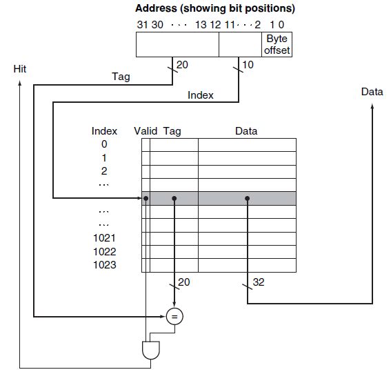


* **Analysis:** (is larger block size increases the performance?  -- Not exactly)

  * Larger blocks exploit spatial locality to lower miss rates.

  * The miss rate may go up eventually if the block size becomes a significant fraction of the cache size.

    Because the number of blocks that can be held in the cache will become small, and there will be a great deal of competition for those blocks

  * spatial locality among the words in a block decreases with a very large block; consequently, the benefits in the miss rate become smaller.

  * more serious problem associated with just increasing the block size is that the cost of a miss increases.

    miss penalty:

    * The time to fetch the block
      * the latency to the first word
      * the transfer time for the rest of the block.
    * load it into the cache

  * (The result is that the increase in the miss penalty overwhelms the decrease in the miss rate for blocks that are too large, and cache performance thus decreases.)

  * **To avoid performance loss**

    * Increase the bandwidth of main memory

      

* How to solve the problem that big block will bring long latency so that it will increase the miss penalty?

  * Early Start:  is simply to resume execution as soon as the requested word of the block is returned, rather than wait for the entire block.
  * Request word first
  * Critical word first

#### 5.3.2 Handling Cache Misses

* Cache miss: A request for data from the cache that cannot be filled because the data is not present in the cache

  * Handling: 1. processor control unit 2. separate controller

  On a miss, we simply stall the processor until the memory responds with the data

  ```
  1. Send the original PC value (current PC – 4) to the memory.
  2. Instruct main memory to perform a read and wait for the memory to complete its access.
  3. Write the cache entry, putting the data from memory in the data portion of the entry, writing the upper bits of the address (from the ALU) into the tag field, and turning the valid bit on.
  4. Restart the instruction execution at the fi rst step, which will refetch the instruction, this time finding it in the cache.
  ```

#### 5.3.3 Handling Writes

* **write-through**
  A scheme in which writes always update both the cache and the next lower level of the memory hierarchy, ensuring that data is always consistent between the two.
* **write buffer**
  A queue that holds data while the data is waiting to be written to memory.
* **write-back**
  A scheme that handles writes by updating values only to the block in the cache, then writing the modified block to the lower level of the hierarchy when the block is replaced.

* in a write-through cache, writes can always be done in one cycle.
  in a write-back cache, writes must be done in 2 cycle. A cycle to check for a hit followed by a cycle to actually perform the write. 

* In a write-back cache, we must **first write the block back**
  **to memory if the data in the cache is modified** and we have a cache miss. 

  If we simply overwrote the block on a store instruction before we knew **whether the store had hit in the cache** (as we could for a write-through cache), we would destroy the contents of the
  block, which is not backed up in the next lower level of the memory hierarchy.


* split cache: 
  A scheme in which a level of the memory hierarchy is composed of two independent caches that operate in parallel with each other, with one handling instructions and one handling data.

### 5.4 Measuring and Improving Cache Performance

* CPU time = (CPU execution clock cycles + Memory-stall clock cycles) X Clock cycle time

* Memory-stall clock cycles = (Read-stall cycles + Write-stall cycles)
* Read-stall cycles = (Reads / Program) X Read miss rate X Read miss penalty
* Write-stall cycles = (Writes / Program X Write miss rate X Write miss penalty) + Write buffer stalls
* Memory-stall clock cycles = Memory accesses / Program X Miass rate X Miss penalty
* Memory-stall cycles = (Instructions / Program) X (Misses / Instruction) X Miss penalty


**What happens if the processor is made faster, but the memory system is not?**
---- The amount of time spent on memory stalls will take up an increasing fraction of the execution time


* $$
  AMAT =Time\ for\ a\ hit\ + \ Miss\ rate \times Miss\ penalty
  $$

#### 5.4.1 Reducing Cache Misses by More Flexible Placement of Blocks (KEY)

* Mapping mechanism:

  * Direct mapped cache:
    Direct mapping from any block address in memory to a single location in the upper level of the hierarchy

    **(Block number) mod (Number of blocks in the cache)**

  * Fully Associative cache:
    A cache structure in which a block can be placed in any location in the cache.

  * Set-associative cache:
    A cache that has a fixed number of locations (at least two) where each block can be placed.

    **(Block number) mod (Number of SETs in the cache)**

  * 
  * 
  * 

* Advantage/Disadvantage of Increasing the degree of associativity
  * Usually decreases the miss rate
  * But increase in the hit time


#### 5.4.3 Choosing Which Block to Replace

* LRU(least recently used): 
  A replacement scheme in which the block replaced is the one that has been unused for the longest time.

#### 5.4.4 Reducing the Miss Penalty Using Multilevel Caches

* The Primary cache to focus on **minimizing hit time** to yield a shorter clock cycle or fewer pipeline stages.
* The secondary cache to focus on **miss rate** to reduce the penalty 
* **Total CPI = 1 + Primary stalls per instruction + Secondary stalls per instruction**


#### 5.4.5 Software Optimization via Blocking

* Using Blocking to speed up multiple of matrices
  ```c
  #define BLOCKSIZE 32
  void do_block(int n, int sj, int sk, double *A, double *B, double *C){
      for(int i=si;i<si+BLOCKSIZE;++i){
          for(int j=sj;j<sj+BLOCKSIZE;++j){
              double cij = C[i][j];
              for(int k=sk;k<sk+BLOCKSIZE;++k){
                  cij += A[i][k]*B[k][j];
              }
  			C[i][j] = cij;
          }
      }
  }
  
  void dgemm(int n, double* A, double* B, double* C){
      for(int sj=0;sj<n;sj+=BLOCKSIZE){
          for(int si=0;si<n;si+=BLOCKSIZE){
              for(int sk=0;sk<n;sk+=BLOCKSIZE){
                  do_block(n, si, sj, sk, A, B, C);
              }
          }
      }
  }
  ```

  

### 5.7 Virtual Machines (KEY)

Main memory --(cache) --> Disk

**Virtual memory:**
	**A technique that uses main memory as a “cache” for secondary storage.**

* Motivation of developing Virtual memory: 
  1. allow efficient and safe sharing of memory among multiple programs
  2. to remove the programming burdens of a small, limited amount of main memory

* Some terminologies:

  * Physical address:
    An address in main memory

  * Protection:
    ensuring that multiple processes sharing the processor, memory, or I/O devices cannot interfere, intentionally or unintentionally, with one another by reading or writing each other’s data.

  * page fault:
    An event that occurs when an accessed page is not present in main memory.

  * virtual address:
    An address that  corresponds to a location in virtual space and is translated by address mapping to a physical address when memory is accessed.

  * address translation:
    (address mapping) The process by which a virtual address is mapped to an address used to access memory.

  * relocation:
    Relocation maps the virtual addresses used by a program to different physical addresses before the addresses are used to access memory. Th is relocation allows us to load the program anywhere in main memory

  * segmentation:
    A variable-size address mapping scheme in which an address consists of two parts: a segment number, which is mapped to a physical address, and a segment off set.

    *(Elaborating in OS)*

  * 

**Some key decisions:**

* Pages should be large enough to try to **amortize(弥补) the high access time** 
* Organizations that reduce the page fault rate are attractive
* Page faults can be handled in software because the overhead(开销) will be small compared to the disk access time
* Write-through will not work for virtual memory, since writes take too long.


#### 5.7.1 Placing a Page and Finding It Again

* Page table: (pointed by **Page Table Register**)
  The table containing the virtual to physical address translations in a virtual memory system. The table, which is stored in memory, is typically indexed by the virtual page number; each entry in the table contains the physical page number for that virtual page if the page is currently in memory.

* Procedure:
  

#### 5.7.2 Page Faults (KEY)

​	**If the valid bit for a virtual page is off , a page fault occurs. Th e operating system**
**must be given control. Th is transfer is done with the exception mechanism**

--> Once the operating system gets control, it must fi nd the page in the next level of the hierarchy (usually flash memory or magnetic disk) and decide where to place the requested page in main memory.

* Swap Space:

  Because we do not know ahead of time when a page in memory will be replaced, the operating system usually creates the space on flash memory or disk for all the pages of a process when it creates the process. Th is space is called the swap space.

* 2 Page Table
  One for main memory, another for disk

* LRU replace mechanism:
  --> hard to implement

  * reference bit (use bit):
    A field that is set whenever a page is accessed and that is used to implement LRU or other replacement schemes.

* **How to reduce the amount of storage required for the page table?**
  Every process need a page table? --> Solving Method: 
  1. Keep a limit register that restricts the size of the page table for a given process(Only when process becomes large, page table will be large)
  2. 2 page table: breaks the address space into 2 segments
  3. apply a hashing function to the virtual address
  4. Multiple levels of page table


#### 5.7.3 Writes

We must use write-back mechanism in Virtual Memory System(Write process takes too long time)

* Dirty bit: 

  To track whether a page has been written since it was read into
  the memory, a dirty bit is added to the page table.

  The dirty bit is set when any word in a page is written. If the operating system chooses to replace the page, the dirty bit indicates whether the page needs to be written out before its location in memory can be given to another page.


#### 5.7.4 TLB （Translation-Lookaside Buffer）

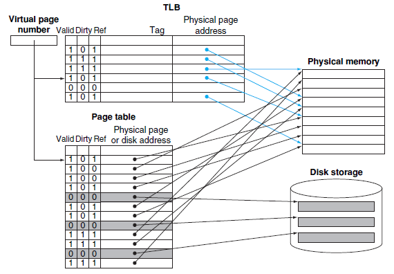

* TLB miss: (can be handled either in hardware or in software)
  1. We should check whether it is simply a TLB miss or a page fault
  2. if the page in main memory -> TLB miss
     if not, -> Page Fault
  3. TLB miss -> the processor can handle the TLB miss by loading the translation from the page table into the TLB and then trying the reference again.
  4. Replacement of TLB entry?
     TLB entry contains DIRTY BIT and REFERENCE BIT.


* Large Image:
  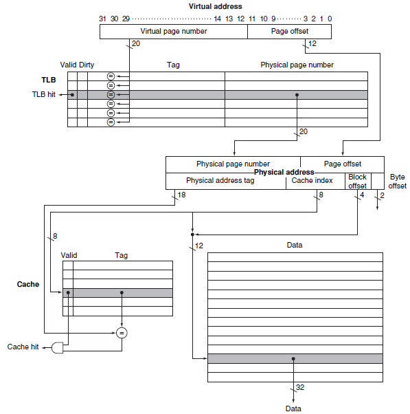

* Procedure:
  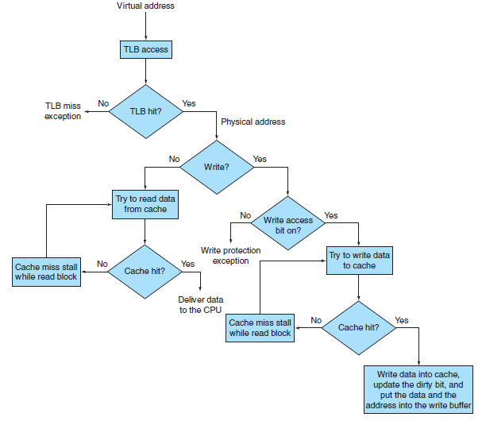

* Virtually addressed cache:

  Alternatively, the processor can index the cache with an address that is completely or partially virtual. This is called a virtually addressed cache
  A cache that is accessed with a virtual address rather than a physical address.
  (Not use TLB)

* Aliasing:
  A situation in which two addresses access the same object; it can occur in virtual memory when there are two virtual addresses for the same physical page.


#### 5.7.7 Handling TLB Misses and Page Faults

* Two situations
  1. Th e page is present in memory, and we need only create the missing TLB entry.
  2. The page is not present in memory, and we need to transfer control to the operating system to deal with a page fault.

* Once OS knows the Virtual Address causing Page Faults
  1. Look up the page table entry using the virtual address and fi nd the location of the referenced page on disk.
  2. Choose a physical page to replace; if the chosen page is dirty, it must be written out to disk before we can bring a new virtual page into this physical page.
  3. Start a read to bring the referenced page from disk into the chosen physical page.

#### 5.7.8 Summary

* Techniques to reduce page fault rate(miss rate)
  1. Pages are made large to take advantage of spatial locality and to reduce the miss rate
  2. The mapping between virtual addresses and physical addresses, which is
     implemented with a page table, is made **fully associative** so that a virtual page can be placed anywhere in main memory.
  3. The operating system uses techniques, such as LRU and a reference bit, to choose which pages to replace.


* Why **Fully Associative**？
  1. Full associativity is beneficial, since misses are very expensive.
  2. Full associativity allows soft ware to use sophisticated replacement schemes that are designed to reduce the miss rate.
  3. The full map can be easily indexed with no extra hardware and no searching required.

So Virtual Memory System often apply Fully Associative placement
And cache and TLB use set-associative placement

* Replacement strategy when have a miss
  1. Random
  2. Least Recently Used


#### 5.8.5 3C: Behavior of Memory Hierarchies

* Compulsory misses: (cold-start misses)
  These are cache misses caused by the fi rst access to
  a block that has never been in the cache
* Capacity misses:
  These are cache misses caused when the cache cannot
  contain all the blocks needed during execution of a program. 
  Capacity misses occur when blocks are replaced and then later retrieved.
* Conflict misses: (collision miss)
  These are cache misses that occur in set-associative or
  direct-mapped caches when multiple blocks compete for the same set.
  In fully associative cache it do not exist.

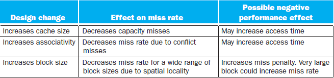


## Some tricks or tips

* Loop Unrolling:
  Loop unrolling is used to avoid pipeline hazards to some extent. 

  A technique to get more performance from loops that access arrays, in which multiple copies of the loop body are made and instructions from different iterations are scheduled together.
  Loop-unrolling involves taking a loop, replicating the body multiple times, and executing the transformed loop fewer times. 

  Loop-unrolling reduces the loop overhead and provides opportunities for many other optimizations.

* 
