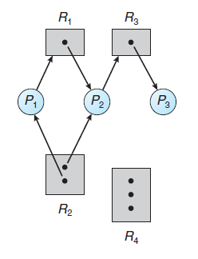
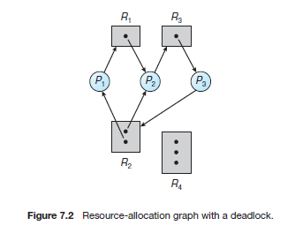
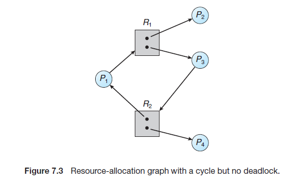
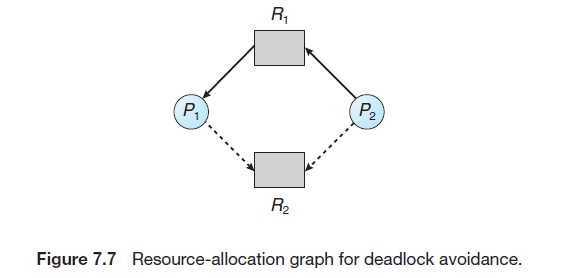
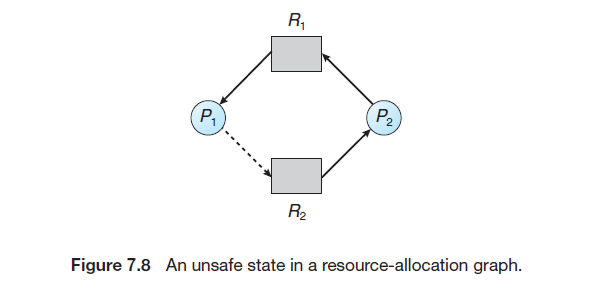

# Operation System Concepts

[TOC]


## Part 2 PROCESS MANAGEMENT

### Chap 3 Process (Some concept)

#### 3.1 Process Concept

##### 3.1.1 Process

* Process:

  * Text Section
  * Program Counter
  * Stack
  * Data Section

  * Heap

  A program is a passive entity. A process is an active entity.

##### 3.1.2 Process State

* State
  * New: The process is being created.
  * Running: Instructions are being executed.
  * Waiting: The process is waiting for some event to occur (such as an I/O completion or reception of a signal).
  * Ready: The process is waiting to be assigned to a processor.
  * Terminated: The process has finished execution.

##### 3.1.3 Process Control Block

* PCB (Task control block)
  * process state
  * program counter
  * CPU register
  * CPU-scheduling information
  * memory-management information
  * accounting information
  * I/O status information

##### 3.1.4 Threads

A process is a program that performs **a single thread** of execution.


#### 3.2 Process Scheduling

* The objective of multiprogramming:
  to have some process running at all times, to maximize CPU utilization
* The objective of time sharing:
  to switch the CPU among processes so frequently that users can interact with each program while it is running.
* Process scheduler:
  Select an available process for program execution on the CPU

##### 3.2.1 Scheduling Queues

* Job Queue
* Ready Queue
* Device Queue

Dispatched 

##### 3.2.2 Scheduler

* Scheduler

  * Long-term scheduler / Job scheduler
    selects processes from this pool(mass-storage device ,often in disk) and loads them into memory for execution

    (controls the degree of multiprogramming (the number of processes in memory).)

  * Short-term scheduler / CPU scheduler
    selects from among the processes that are ready to execute and allocates the CPU to one of them.

* Most of processes can be described as:

  * I/O bound process:
    Spending more of its time doing I/O than it spends doing computations.

  * CPU bound process:
    In contrast, generates I/O requests infrequently, using more of its time doing computations

* Medium-term scheduler: 
  The key idea behind a medium-term scheduler is
  that sometimes it can be advantageous to remove a process from memory
  (and from active contention for the CPU) and thus reduce the degree of
  multiprogramming. Later, the process can be reintroduced into memory, and its execution can be continued where it left off.

  This scheme is called **swapping**

  * Swap out
  * Swap in

##### 3.2.3 Context Switch

When an **interrupt** occurs, the system needs to save the current context of the process running on the CPU so that it can restore that context when its processing is done, essentially suspending the process and then resuming it.


#### 3.3 Operations on Process

* PID(process identifier)
* When a process creates a new process, two possibilities for execution exist:
  1. The parent continues to execute concurrently with its children
  2. The parent waits until some or all of its children have terminated
* There are also two address-space possibilities for the new process:
  1. The child process is a duplicate of the parent process (it has the same program and data as the parent).
  2. The child process has a new program loaded into it.

* A parent may terminate the execution of one of its children for a variety of reasons
  1. The child has exceeded its usage of some of the resources that it has been allocated.
  2. The task assigned to the child is no longer required.
  3. The parent is exiting, and the operating system does not allow a child to continue if its parent terminates.
* Cascade termination
  Some systems do not allow a child to exist if its parent has terminated. So if a process terminates (either normally or abnormally), then all its children must also be terminated
* Zombie process
  A process that has terminated, but whose parent has not yet called `wait()`.
  Parent process call `wait()` to remove the entry in process table.

#### 3.4 Interprocess Communication

* Reasons for providing an environment that allows process cooperation
  * Information sharing
  * Computation speedup
  * Modularity
  * Convenience
* IPC mechanism (InterProcess Communication)
  There are 2 fundamental models:
  1. Shared memory
  2. Message passing

* Cooperating processes

  * Producer
  * Consumer
  * Buffer
    * unbounded buffer
    * bounded buffer

* Synchronization

  * Blocking send
  * Nonblocking send
  * Blocking receive
  * Nonblocking receive

* Buffering

  Whether communication is direct or indirect, messages exchanged by communicating processes reside in a temporary queue
  Queues can be implemented in 3 ways

  * Zero Capacity
  * Bounded Capacity
  * Unbounded Capacity

### Chap 5 CPU Scheduling

#### 5.1 Basic Concepts

***The objective of multiprogramming is to have some process running at all times, to maximize CPU utilization.***

* Preemptive Scheduling
  Nonpreemptive Scheduling

* Dispatcher

  * Switching context
  * Switching to user mode
  * Jumping to the proper location in the user program to restart that program

  The time it takes for the dispatcher to stop one process and
  start another running is known as the **dispatch latency**.

  

#### 5.2 Scheduling Criteria

* CPU utilization
* Throughput
* Turnaround Time
* Waiting Time
* Response Time

#### 5.3 Scheduling Algorithm (KEY)

* FCFS (Non-preemptive)

  * Disadvantage: Average waiting time is quite long

* SJF (preemptive or Non-preemptive)
  shortest-remaining-time-first

* Priority Scheduling

  * Problem: Indefinite blocking / starvation
  * Solving: Aging

* Round-Robin (RB)

  * Time quantum / Time slice
  * Problem: Average waiting time is often long
  * performance is often depend on length of time slice
    -> Expecting time slice is longer than Context Switching Time

* Multilevel Queue Scheduling
  Foreground process / Background process

  A multilevel queue scheduling algorithm partitions the ready queue into several separate queues

* Multilevel Feedback Queue

  The multilevel feedback queue scheduling algorithm allows a process to move between queues.

  if a process uses too much CPU time, it will be moved to a lower-priority queue


#### 5.6 Real-Time CPU Scheduling (KEY)

* Real-Time CPU
  * Soft real-time system
  * Hard real-time system

* Priority-Based Scheduling
  Process is periodic

  * admission-control

* **Rate-Monotonic Scheduling**
  **static priority policy with preemption**

  The shorter the period, the higher the priority; the longer the period, the lower the priority.

* EDF (Earliest-Deadline-First Scheduling)
  Dynamically assigns priorities according to deadline.

* Proportional share

### Chap 6 Process Synchronization (KEY)

#### 6.2 Deadlock Characterization

```
do {
	[Entry Section]
		critical section
	[Exit Section]
}
```

* Critical-Section
  When one process is executing in its critical section, no other process is allowed to execute in its critical section
  * critical-section problem
    To design a protocol that the processes can use to cooperate.
  * Entry section
  * Exit section
  * Remainder Section

* Solving Problem:

  * Mutual Exclusion:
    If process $P_i$ is executing in its critical section, then no other processes can be executing in their critical sections.

  * Progress:
    If no process is executing in its critical section and some processes wish to enter their critical sections, then only those processes that are not executing in their remainder sections can participate in deciding which will enter its critical section next, and this selection cannot be postponed indefinitely.

  * Bounded Waiting:
    There exists a bound, or limit, on the number of times that other processes are allowed to enter their critical sections after a

* Methods

  * Preemptive kernel
  * Non-preemptive kernal

  A preemptive kernel allows a process to be preempted while it is running in kernel mode. A nonpreemptive kernel does not allow a process running in kernel mode to be preempted; a kernel-mode process will run until it exits kernel mode, blocks, or voluntarily yields control of the CPU.

#### 6.3 Peterson’s Solution

Peterson’s solution requires the two processes to share two data items:

`int turn;`
`boolean flag[2];`

```
do {
	【flag[i] = true】
	【turn = j】
	【while (flag[j] && turn == j)】
		Critical Section
	【flag[i] = false】
		Remainder Section
} while (true)
```

* Elaboration:
  The variable `turn` indicates whose turn it is to enter its critical section.
  `flag[]` array is used to indicate if a process is ready to enter its critical section.
  To enter the critical section, process $P_i$ first sets `flag[i]` to be `true` and then sets `turn` to the value `j`, thereby a asserting that if the other process wishes to enter the critical section, it can do so.
  If both process try to enter at the same time, turn will be set to both `i` and `j` at roughly the same time. Only one of these assignments will last; the other will occur but will be overwritten immediately.
  The eventual value of `turn` determines which of the 2 processes is allowed to enter its critical section first.
* Proof of 3 principle
  1. Mutual exclusion is preserved.
      If $P_i$ is in critical section. Then there will be `flag[i]==true` and `turn == j` hold. So $P_j$ will wait until `flag[i]==false`
     If there are 2 process in critical section. `flag[0]==flag[1]==true` it is impossible.
  2. Progress
  3. Bounded-waiting
     If $P_i$ is finished. Then `flag[i]=false`. Then $P_j$ can enter critical section.

#### 6.4 Synchronization Hardware

The critical-section problem could be solved simply in a single-processor
environment if we could **prevent interrupts from occurring while a shared**
**variable was being modified.**

Many modern computer systems therefore provide special hardware
instructions that allow us either to test and modify the content of a word or to swap the contents of two words atomically—that is, as one uninterruptible unit

* Test_And_Set:

  ```
  boolean test_and_set (boolean *target) {
  	boolean rv = *target;   
  	*target = true;		/* SET */
  	return rv;			/* TEST */
  }
  ```

* ```
  do {
  	while (test_and_set(&lock))
  	; /* do nothing */
  	
  
  	/* critical section */
  	
  	lock = false
  	
  	/* remainder section */
  
  } while(true)
  ```

* Compare_And_Swap()
  Idea: Hardware instructions allow us modify or swap the contents of 2 words ATOMICALLY.
  `int lock = 0`

  ```
  int compare_and_swap(int *value, int expected, int new_value) {
  	int temp = *value;
  	
  	if(*value == expected)	/* COMPARE */
  		*value = new_value;
  	return temp;
  }
  ```

  ```
  do {
  	while(compare_and_swap(&lock, 0, 1) != 0)
  	;	// donothing
  	
  	/* critical section */
  	
  	lock = 0;
  	
  	/* remainder section */
  }
  ```

  The process that call `compare_and_swap` will set `lock` to 1.
  Only when `lock==0` other process can enter critical section. 

* Bounded-waiting mutual exclusion with `test and set()`

  * To prove that the progress requirement is met, we note that the arguments presented for mutual exclusion also apply here, since a process exiting the critical section either sets lock to false or sets waiting[j] to false. Both allow a process that is waiting to enter its critical section to proceed.
  * To prove that the bounded-waiting requirement is met,we note that, when a process leaves its critical section, it scans the array waiting in the cyclic ordering (i + 1, i + 2, ..., n − 1, 0, ..., i − 1). It designates the first process in this ordering that is in the entry section (waiting[j] == true) as the next one to enter the critical section. Any process waiting to enter its critical section will thus do so within n − 1 turns.

  ```
  do {
  	waiting[i] = true;
  	key = true;
  	while(waiting[i] && key)
  		key = test_and_set(&lock)
  	waiting[i] = false;
  	
  	/* Critical Section */
  	
  	j = (i+1)%n;
  	while( ( j != i ) && !waiting[j] )
      	j = (j+1) % n;
      
      if(j==i)
      	lock = false;
      else
      	waiting[j] = false;
      	
      /* remainder section */
  
  }while(true)
  ```

#### 6.5 Mutex Locks

We use the mutex lock to protect critical regions and thus prevent race conditions.

That is, a process must acquire the lock before entering a critical section; it releases the lock when it exits the critical section.

The `acquire()` function acquires the lock, and the `release()` function releases the lock

**Atomically**

```
acquire() {
	while(!available)
	; /* Busy waiting */
	available = false;
}

release() {
	available = true;
}
```

* Disadvantage:
  Busy waiting. While a process is in its critical section, any other process that tries to enter its critical section must loop continuously in the call to `acquire()`. (also called **Spinlock**)
* Advantage:
  No context switch is required when a process must wait on a lock, and a context switch may take considerable time.
* Application
  Multiprocessor systems


#### 6.6 Semaphores (KEY)

A semaphore $S$ is an integer variable that, apart from initialization, is accessed only through two standard **atomic** operations: `wait()` ($P$) and `signal()` ($V$).

```
wait(S) {
	while(S <= 0)
		; // busy wait
	S--;
}

signal(S) {
	S++;
}
```

##### 6.6.1 Semaphore Usage

* Type
  * counting semaphore
  * binary semaphore

**The semaphore is initialized to the number of resources available**

##### 6.6.2 Semaphore Implementation

```
typedef struct {
	int value;
	struct process *list;
}semaphore;
```

```
wait(semaphore *S) {
	S->value--;
	if (S->value < 0){
		add this process to S->list;
		block
	}
}

signal(semaphore *S) {
	S->value++;
	if (S->value <= 0)
		remove a process P from S->list;
		wakeup(P);
}
```

* `block`
  The `block()` operation suspends the process that invokes it.
* `wakeup`
  The `wakeup(P)` operation resumes the execution of a blocked process P.
* Implementation:
  FIFO queue

##### 6.6.3 Deadlocks and Starvation

* Deadlock
  The implementation of a semaphore with a waiting queue may result in a situation where two or more processes are waiting indefinitely for an event that can be caused only by one of the waiting processes. The event in question is the execution of a signal() operation. When such a state is reached, these processes are said to be deadlocked.
* Indefinite blocking / Starvation
  Indefinite blocking may occur if we remove processes from the list associated with a semaphore in LIFO (last-in, first-out) order.

##### 6.6.4 Priority Inversion

* priority inversion
  It occurs only in systems with more than two priorities, so one solution is to have only two priorities.
* Solving:
  priority-inheritance protocp;

#### 6.7 Classic Problems of Synchronization

##### 6.7.1 The Bounded-Buffer Problem

`int n;`				  // n buffers in pool
`semaphore mutex = 1;`	// mutual exclusion for accesses to the buffer pool
`semaphore empty = n`
`semaphore full = 0;`
// The empty and full semaphores count the number of empty and full buffers.

* Code:
  **the producer producing full buffers for the consumer or as the consumer producing empty buffers for the producer.**

  * The structure of the producer process

    ```
    do {
    	...
    	/* produce an item in next produced */
    	...
    	wait(empty);
    	wait(mutex);
    	...
    	/* add next produced to the buffer */
    	...
        signal(mutex);
        signal(full);
    } while (true);
    ```

  * The structure of the consumer process

    ```
    do {
    	wait(full);
    	wait(mutex);
    	. . .
    	/* remove an item from buffer to next consumed */
    	. . .
        signal(mutex);
        signal(empty);
        . . .
        /* consume the item in next consumed */
        . . .
    } while (true);
    ```

##### 6.7.2 The Readers-Writers WWProblem

* Suppose that a database is to be shared among several concurrent processes. 
  Some of these processes may want only to **read** the database, whereas others may want to **update** (that is, to read and write) the database. 
  We distinguish between these two types of processes by referring to the former as **readers** and to the latter as **writers**. 
  Obviously, if two readers access the shared data
  simultaneously, no adverse effects will result. 
  However, if a writer and some other process (either a reader or a writer) access the database simultaneously,
  chaos may ensue.

  To ensure that these difficulties do not arise, we **require that the writers have exclusive access to the shared database while writing to the database**

* Type of Problems

  1. first readers–writers problem:
     requires that no reader be kept waiting unless a writer has already obtained permission to use the shared object.

     **Readers and writers are mutually exclusive**, writers and writers are mutually exclusive, and readers and readers do not have the problem of mutual exclusion.
     **(writers may starve)**

  2. second readers–writers problem
     requires that, once a writer is ready, that writer perform its write as soon as possible
     **(readers may starve.)**

* Solution of First Reader-Writer Problem

  ```
  semaphore rw_mutex = 1;
  semaphore mutex = 1;
  int read_count = 0;
  ```

  The semaphore `rw` mutex functions as a mutual exclusion semaphore for the writers. It is also used by the first or last reader that enters or exits the critical section. It is not used by readers who enter or exit while other readers are in their critical sections.

  * Structure of writer:

    ```
    do {
    	wait(rw_mutex);
    	. . .
    	/* writing is performed */
    	. . .
    	signal(rw mutex);
    } while (true);
    ```

  * Structure of Reader

    ```
    do {
        wait(mutex);
        read_count++;
        if (read count == 1)
        	wait(rw mutex);		// begin reading
        signal(mutex);
        . . .
        /* reading is performed */
        . . .
        wait(mutex);
        read count--;
        if (read count == 0)
       		signal(rw mutex);	// end reading
        signal(mutex);
    } while (true);
    ```

* Reader-Writer locks:

  * In applications where it is easy to identify which processes only read shared data and which processes only write shared data.
  * In applications that have **more readers than writers.** This is because reader– writer locks generally require more overhead to establish than semaphores or mutual-exclusion locks. The increased concurrency of allowing multiple readers compensates for the overhead involved in setting up the reader–writer lock.

##### 6.7.3 The Dining-Philosophers Problem

It is a simple representation of the need to allocate several resources among several processes in a deadlock-free and starvation-free manner.

`semaphore chopstick[5]`

* The structure of philosopher i

  ```
  do {
      wait(chopstick[i]);
      wait(chopstick[(i+1) % 5]);
      . . .
      /* eat for awhile */
      . . .
      signal(chopstick[i]);
      signal(chopstick[(i+1) % 5]);
      . . .
      /* think for awhile */
      . . .
  } while (true);
  ```

* Solution of Deadlock

  * Allow at most four philosophers to be sitting simultaneously at the table
  * Allow a philosopher to pick up her chopsticks only if both chopsticks are available (to do this, **she must pick them up in a critical section**).
  * Use an asymmetric solution—that is, an odd-numbered philosopher picks up first her left chopstick and then her right chopstick, whereas an even numbered philosopher picks up her right chopstick and then her left chopstick.

#### 6.8 Monitors

* Motivation:

  The semaphore’s using order is mattered. To deal with this danger--> high-level language constructs

### Chap 7 Deadlocks (KEY)

* Deadlock
  A process requests resources; if the resources are not available at that time, the process enters a waiting state. Sometimes, a waiting process is never again able to change state, because the resources it has requested are held by other waiting processes. This situation is called a deadlock.

  OR:

  A set of processes is in a deadlocked state when every process in the set is waiting for an event that can be caused only by another process in the set.

#### 7.2 Deadlock Characterization

* Necessary Conditions

  * Mutual exclusion
  * Hold and wait
  * No preemption
  * Circular wait

* Resource-Allocation Graph
  
  
  

  In summary, if a resource-allocation graph does not have a cycle, then the system is not in a deadlocked state. If there is a cycle, then the system may or may not be in a deadlocked state. This observation is important when we deal with the deadlock problem.

#### 7.3 Methods for Handling Deadlocks

* 3 ways:
  1. We can use a protocol to prevent or avoid deadlocks, ensuring that the system will never enter a deadlocked state.
  2. We can allow the system to enter a deadlocked state, detect it, and recover.
  3. We can ignore the problem altogether and pretend that deadlocks never occur in the system.

#### 7.4 Deadlock Prevention

##### 7.4.1 Mutual Exclusion

The mutual exclusion condition must hold. That is, at least one resource must be non-sharable.

Sharable resources, in contrast, do not require mutually exclusive
access and thus cannot be involved in a deadlock

Example: Read-Only Files

##### 7.4.2 Hold and Wait

To ensure that the hold-and-wait condition never occurs in the system, we must guarantee that, whenever a process requests a resource, it does not hold any other resources.

* Protocol:

  * One protocol : that we can use requires each process to request
    and be allocated **all its resources** before it begins execution

    We can implement this provision by requiring that system calls requesting resources for a process precede all other system calls.

  * An alternative protocol:  allows a process to request resources only when it has none.

* Disadvantages:
  1. resource utilization may be low
  2. starvation is possible.

##### 7.4.3 No Preemption

* Protocol
  If a process is holding some resources and requests another resource that cannot be immediately allocated to it (that is, the process must wait), then all resources the process is currently holding are preempted. In other words, these resources are implicitly released

* Alternatively:

  if a process requests some resources->

  1. we first check whether they are available.
     * If they are, we allocate them. 
     * If they are not, we check whether they are allocated to some other process that is waiting for additional resources. 
       * If so, we preempt the desired resources from the waiting process and allocate them to the requesting process. 
  2. If the resources are neither available nor held by a waiting process, the requesting process must wait. 
     While it is waiting, some of its resources may be preempted, but only if another process requests them. 
  3. A process can be restarted only when it is allocated the new
     resources it is requesting and recovers any resources that were preempted while it was waiting.

* This protocol is often applied to resources whose state can be easily saved and restored later, such as CPU registers and memory space. It cannot generally be applied to such resources as mutex locks and semaphores.

##### 7.4.4 Circular Wait

* Way to ensure that this condition never holds:
  To impose a total ordering of all resource types and to require that each process requests resources in an increasing order of enumeration.

#### 7.5 Deadlock Avoidance

* Motivation:
  Deadlock Prevention will cause the low device utilization and reduced system throughput
* Idea:
  With this knowledge of the complete sequence of requests and
  releases for each process, the system can decide for each request whether or not the process should wait in order to avoid a possible future deadlock. 
  Each request requires that in making this decision the system consider the resources currently available, the resources currently allocated to each process, and the future requests and releases of each process.

##### 7.5.1 Safe State:

A state is safe if the system can allocate resources to each process (up to its maximum) in some order and still avoid a deadlock.

##### 7.5.2 Resource-Allocation-Graph Algorithm

* Claim edge





* Resource-Allocation-Graph Algorithm:
  * before process $P_i$ starts executing, all its claim edges must already appear in the resource-allocation graph.
  * Now suppose that process $P_i$ requests resource $R_j$. The request can be granted only if converting the request edge $P_i → R_j$ to an assignment edge $R_j → P_i$ does not result in the formation of a cycle in the resource-allocation graph. We check for safety by using a cycle-detection algorithm.

#### 7.6 Banker’s Algorithm (KEY)

* Basic Idea:
  When a new process enters the system, it must declare the maximum
  number of instances of each resource type that it may need. This number may not exceed the total number of resources in the system. When a user requests a set of resources, the system must determine whether the allocation of these resources will leave the system in a safe state. If it will, the resources are allocated; otherwise, the process must wait until some other process releases enough resources.

* Data Structure:

  * Available:
    A vector of length $m$ indicates the number of available resources of each type. If $Available[j]$ equals $k$, then $k$ instances of resource type $R_j$ are available.
  * Max:
    An $n × m$ matrix defines the maximum demand of each process.
    If $Max[i][j]$ equals $k$, then process $P_i$ may request at most $k$ instances of resource type $ R_j $.
  * Allocation:
    An $n × m$ matrix defines the number of resources of each type
    currently allocated to each process. If $Allocation[i][j]$ equals $k$, then process $P_i$ is currently allocated $k$ instances of resource type $R_j$ .
  * Need:
    An $n × m$ matrix indicates the remaining resource need of each
    process. If $Need[i][j]$ equals $k$, then process $P_i$ may need $k$ more instances of resource type $R_j$ to complete its task. Note that $Need[i][j]$ equals $Max[i][j] - Allocation[i][j].$
  * $Allocation_i$​ specifies the resources currently allocated to process $P_i$
    $Need_i$​ specifies the additional resources that process $P_i$ may still request to complete its task.

* Safety Algorithm

  ```
  1. Let Work and Finish be vectors of length m and n, respectively. 
  Initialize Work = Available and Finish[i] = false for i = 0, 1, ..., n − 1.
  2. Find an index i such that both
  	a. Finish[i] == false
  	b. Needi ≤Work
  	If no such i exists, go to step 4.
  3. Work = Work + Allocationi
  	Finish[i] = true
      Go to step 2.
  4. If Finish[i] == true for all i, then the system is in a safe state.
  ```

* Resource-Request Algorithm

  ```
  1. If Requesti ≤ Needi , go to step 2. Otherwise, raise an error condition, since the process has exceeded its maximum claim.
  2. If Requesti ≤ Available, go to step 3. Otherwise, Pi must wait, since the resources are not available.
  3. Have the system pretend to have allocated the requested resources to process Pi by modifying the state as follows:
  		Available = Available–Requesti ;
  		Allocationi = Allocationi + Requesti ;
  		Needi = Needi –Requesti ;
  If the resulting resource-allocation state is safe, the transaction is completed, and process Pi is allocated its resources. 
  However, if the new state is unsafe, then Pi must wait for Requesti, and the old resource-allocation state is restored.
  ```

#### 7.6 Deadlock Detection


## Part 3 MEMORY MANAGEMENT

### Chap 8 Main Memory


### Chap 9 Virtual Memory


